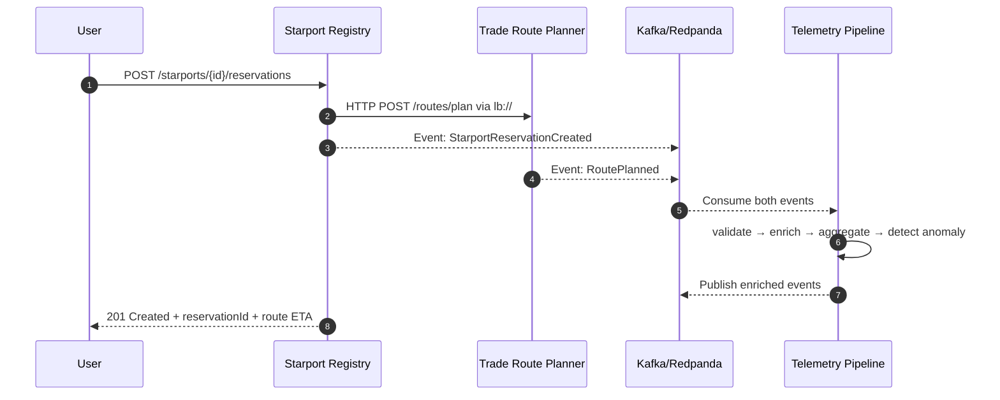
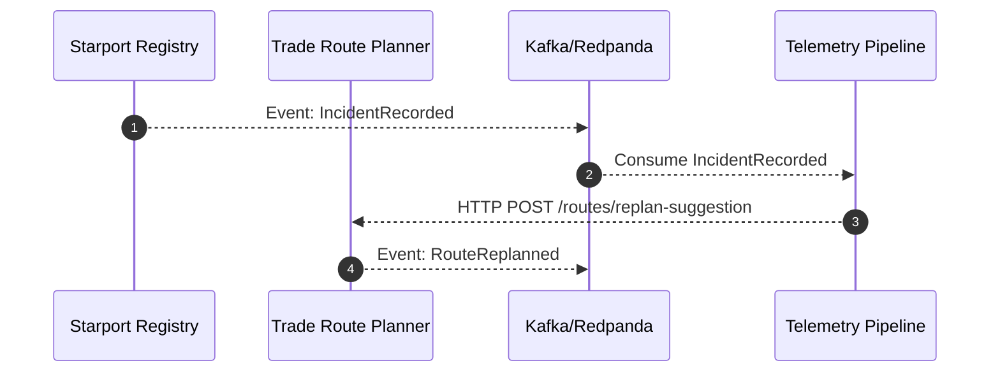

# 🪐 Sci-Fi Microservices Fleet

A **three-service microfleet** set in a sci-fi universe. Each service uses a **different
architecture style**:

1. **Layered** — starport-registry
2. **Hexagonal (Ports & Adapters)** — trade-route-planner
3. **Pipes & Filters** — telemetry-pipeline

Plus `eureka-server` for service discovery.

> **Status — implemented.** All three services are running, registered in Eureka,
> fronted by a Spring Cloud Gateway (single public ingress on :8080 — ADR-0031),
> producing / consuming Kafka events, wired into a Prometheus + Grafana + Tempo + Loki
> observability stack, covered by a multi-layer test pyramid, and documented by
> **32 ADRs** in [`adr/`](adr/README.md).

**Stack:** Java 21 (Project Loom / Virtual Threads), Spring Boot 3.5.6, Spring Cloud 2025,
Spring Cloud Stream + Kafka (KRaft), Spring Data JPA + Flyway + PostgreSQL 16,
Resilience4j, Micrometer Observation + OpenTelemetry, Testcontainers, JUnit 5.

---

## 🚀 Quick Start

```bash
# From repo root:
cd infra/docker
docker compose up --build -d

# Wait for healthchecks (roughly 60-90 s on first run).
docker compose ps

# Smoke test — create a reservation (via api-gateway on :8080)
curl -X POST http://localhost:8080/api/v1/starports/ABC/reservations \
  -H "Content-Type: application/json" \
  -d '{
    "customerCode": "CUST-001",
    "shipCode": "SHIP-001",
    "shipClass": "C",
    "startAt": "2026-05-01T10:00:00Z",
    "endAt":   "2026-05-01T11:00:00Z",
    "requestRoute": false,
    "originPortId": null
  }'
```

Tear down with `docker compose down` (add `-v` to also wipe Grafana / Prometheus volumes).

---

## 🔗 URL Reference

**Only the api-gateway binds a host port for business traffic** — application instances
live on the internal Docker network and are reached through Eureka-resolved `lb://`
URIs (ADR-0031). This matches a production topology: one ingress, many replicas
behind it, no client ever learns an instance-specific URL.

| Component              | URL                                               | Notes                                                   |
|---|---|---|
| **api-gateway** (public ingress) | http://localhost:8080                         | Routes `/api/v1/starports/**` → starport-registry, `/routes/**` → trade-route-planner (ADR-0031) |
| Gateway actuator routes          | http://localhost:8080/actuator/gateway/routes | List active routing rules — useful when a call 404s     |
| Eureka dashboard       | http://localhost:8761                             | Service registry UI; shows live replicas per service     |
| Kafka UI               | http://localhost:8085                             | Topic / consumer-group browser                          |
| Kafka bootstrap        | `localhost:9092` (TCP)                            | For Postman / IDE / `kafka-console-consumer.sh`          |
| PostgreSQL             | `localhost:5432` (DB `starports`, user `postgres`/`postgres`) | Dev-convenience DB access for `psql`, IDE tools |
| Prometheus             | http://localhost:9090                             | Metrics scrape                                          |
| Grafana                | http://localhost:3000 (`admin` / `admin`)         | Unified dashboards (Prom + Tempo + Loki)                |
| Tempo                  | http://localhost:3200                             | Distributed traces API                                  |
| Loki                   | http://localhost:3100                             | Log aggregation                                         |

**Application instances** (`starport-registry-1/2`, `trade-route-planner-1/2`,
`telemetry-pipeline-1/2`) have **no host port binding** — they listen only on the
Compose network. Every replica of a given service uses the same internal port
(starport-registry on 8081, trade-route-planner on 8082, telemetry-pipeline on 8090)
— uniqueness comes from container / hostname, not port (ADR-0031).

**Why?** With `:8081` and `:8084` both exposed, a client could hard-code an
instance URL and bypass the load balancer. The gateway + Eureka setup forces every
request to go through discovery → LB → pick a live replica. That is the production
shape.

**Debugging a single instance** (without re-exposing ports):

```bash
docker compose exec starport-registry-1 wget -qO- http://localhost:8081/actuator/health
docker compose exec starport-registry-2 wget -qO- http://localhost:8081/actuator/health
# Or from the gateway container:
docker compose exec api-gateway wget -qO- http://starport-registry-1:8081/actuator/health
```

Instance health is also visible in Eureka (http://localhost:8761) and in the Prometheus
`up{job="starport-registry"}` metric, which scrapes both replicas over the Compose
network.

---

## 🗂️ Project Structure

```
MicroservicesFleet/
├── adr/                            # 32 Architecture Decision Records + template + index
├── api-gateway/                    # Spring Cloud Gateway — single public ingress (port 8080, ADR-0031)
├── eureka-server/                  # Netflix Eureka service registry (port 8761)
├── starport-registry/              # Layered — reservations, billing, outbox publisher
│   └── src/main/java/com/galactic/starport/
│       ├── controller/             # REST + DTO records + GlobalExceptionHandler
│       ├── service/                # Domain + use-case services
│       │   ├── holdreservation/    # TX1: pessimistic-lock bay + insert HOLD
│       │   ├── confirmreservation/ # TX2: finalise CONFIRMED + publish events
│       │   ├── feecalculator/      # Fee computation (DistributionSummary)
│       │   ├── routeplanner/       # Resilience4j-wrapped HTTP client → Service B
│       │   ├── reservationcalculation/  # Virtual-thread fee+route parallelism
│       │   ├── validation/         # Chain of Responsibility rules (ADR-0023)
│       │   └── outbox/             # Outbox appender + inbox publisher (ADR-0010)
│       ├── repository/             # JPA entities + ReservationMapper (ADR-0024)
│       └── config/                 # @Configuration beans (RestClient, Aspects)
├── trade-route-planner/            # Hexagonal — route planning (ports 8082/8083)
│   └── src/main/java/com/galactic/traderoute/
│       ├── domain/model/           # Pure records (ADR-0021)
│       ├── port/{in,out}/          # Driving + driven ports
│       ├── application/            # Use-case services (implement in-ports)
│       └── adapter/{in/rest,out/kafka}/  # Framework code lives here only
├── telemetry-pipeline/             # Pipes & Filters (ports 8090/8091)
│   └── src/main/java/com/galactic/telemetry/
│       ├── model/                  # Records — one per pipeline stage (ADR-0022)
│       ├── filter/                 # Function<IN,OUT> filters (stateless + 1 stateful)
│       ├── pipeline/               # @Configuration composing the function chain
│       └── config/                 # Threshold properties (@ConfigurationProperties)
├── infra/docker/                   # Compose stack
│   ├── docker-compose.yml          # 15+ services (app × 2 each + observability)
│   ├── grafana/                    # Auto-provisioned datasources + dashboards
│   ├── prometheus/                 # Scrape config
│   ├── tempo.yml / loki.yml / promtail-config.yml
├── scripts/                        # Load-test PowerShell scripts
├── plany/                          # Throughput / concurrency design notes
├── pom.xml                         # Aggregator (BOMs + plugins — ADR-0025)
├── README.md                       # You are here
├── README_2.md                     # HOLD/CONFIRM flow + HTTP/event contracts
└── readme3.md                      # Load-balancing + service-discovery deep-dive
```

`eureka-server` has no business code — it's a thin `@EnableEurekaServer` wrapper.

---

## 🎯 Mission Goals (all met)

1. ✅ Three independent microservices with style-appropriate internals (ADR-0001, 0021, 0022).
2. ✅ Eureka-based service discovery + Spring Cloud LoadBalancer (ADR-0002, 0003).
3. ✅ Observability (PLG + Tempo) from day zero (ADR-0005, 0017, 0030).
4. ✅ Test pyramid: unit + contract + repository + E2E + architecture (ADR-0006, 0029).
5. ✅ ≥2 instances of each service in Docker Compose (ADR-0008, 0026).
6. ✅ Single public ingress via Spring Cloud Gateway; no host-bound instance ports (ADR-0031).
7. ✅ **32 ADRs** covering every non-trivial decision (see [`adr/README.md`](adr/README.md)).

---

## 🧭 The Sci-Fi Domain

We’re building a **Galactic Trade Network**:

### 1) **Starport Registry** — *Layered architecture*
Tracks starports, docking bays, fees, and availability.
- Layers: **API** → **Application** → **Domain** → **Infrastructure**

### 2) **Trade Route Planner** — *Hexagonal architecture*
Computes legal and optimal trade routes across star systems.
- **Core domain** behind ports
- Adapters for persistence, embargo lists, astro charts

### 3) **Telemetry Pipeline** — *Pipes & Filters*
Processes real-time starship telemetry: enrich, aggregate, detect anomalies.
- Stateless filters connected in a chain

---

## 🔧 Tech Stack (as-built)

| Concern               | Choice                                                             | ADR                 |
|---|---|---|
| Language / Runtime    | Java 21 (virtual threads enabled)                                  | ADR-0012            |
| Framework             | Spring Boot 3.5.6 + Spring Cloud 2025.0.0                          | ADR-0025            |
| Service discovery     | Netflix Eureka (standalone for dev)                                | ADR-0002, 0028      |
| Public ingress        | Spring Cloud Gateway + Eureka (`lb://`) — single host-bound port   | ADR-0031            |
| HTTP load balancing   | Spring Cloud LoadBalancer (client-side, `lb://...`)                | ADR-0003            |
| Sync HTTP resilience  | Resilience4j circuit breaker + short timeouts                      | ADR-0014            |
| Messaging             | Apache Kafka 3.7 (KRaft) via Spring Cloud Stream                   | ADR-0004, 0016, 0019 |
| Event delivery        | Transactional Outbox + polling relay                               | ADR-0010            |
| Persistence           | PostgreSQL 16 + Spring Data JPA + Flyway                           | ADR-0007, 0018      |
| Concurrency safety    | `SELECT ... FOR UPDATE SKIP LOCKED` + range-overlap query          | ADR-0020            |
| Observability         | Prometheus + Grafana + Tempo + Loki over OTLP                      | ADR-0005, 0017      |
| Metrics conventions   | Micrometer Observation API, two-tier cardinality                   | ADR-0030            |
| Validation            | Jakarta Bean Validation + Chain of Responsibility rules            | ADR-0023            |
| Testing               | JUnit 5 + Testcontainers + `TestObservationRegistry` + PIT         | ADR-0006, 0029      |
| Build                 | Maven multi-module + BOM pinning + Error Prone / NullAway          | ADR-0025            |
| Container             | Multi-stage Dockerfile (Temurin 21 JRE Alpine, container-aware JVM) | ADR-0026           |
| Deployment            | Docker Compose (2 replicas per service)                            | ADR-0008            |
| Config management     | Env-var overrides + Spring profiles                                | ADR-0009            |

---

## ⚙️ Environment Variables

All services follow the `${ENV_VAR:default}` pattern (ADR-0009). Compose
(`infra/docker/docker-compose.yml`) sets these per container; `./mvnw spring-boot:run`
falls back to the defaults suited for local `localhost`.

| Variable                              | Default                                             | Scope                    |
|---|---|---|
| `PORT`                                | `8080` (api-gateway) / `8081` (starport-registry) / `8082` (trade-route-planner) / `8090` (telemetry-pipeline) / `8761` (eureka-server) | All services |
| `DB_URL`                              | `jdbc:postgresql://localhost:5432/starports`        | starport-registry only   |
| `DB_USER` / `DB_PASS`                 | `postgres` / `postgres`                             | starport-registry only   |
| `KAFKA_BROKERS`                       | `localhost:9092`                                    | All app services         |
| `EUREKA_URL`                          | `http://localhost:8761/eureka`                      | All app services         |
| `EUREKA_SELF_PRESERVATION`            | `false` (dev) — set `true` for prod (ADR-0028)      | eureka-server            |
| `OTEL_EXPORTER_OTLP_TRACES_ENDPOINT`  | `http://tempo:4318/v1/traces`                       | All app services         |
| `OTEL_EXPORTER_OTLP_LOGS_ENDPOINT`    | `http://tempo:4318/v1/logs`                         | All app services         |
| `TRACE_SAMPLING`                      | `1.0` (dev; drop to `0.1` in prod — ADR-0017)       | All app services         |

Secrets (DB password, broker credentials) must **never** be committed to YAML; pass them
only through environment variables.

---

## 📐 Architecture Style Requirements

### Starport Registry — **Layered**
- REST controllers → service layer → domain → Spring Data JPA
- Example: `POST /api/v1/starports/{code}/reservations` (see HTTP Contracts below)

### Trade Route Planner — **Hexagonal**
- Core domain with **ports** (use cases) and **adapters**
- Adapters: REST (API), Postgres (persistence), HTTP clients (embargo/astro data)

### Telemetry Pipeline — **Pipes & Filters**
- Kafka topic → `ValidationFilter` → `EnrichmentFilter` → `AggregationFilter` → `AnomalyDetectionFilter` → sinks
- Implement with **Spring Cloud Stream**

---

## 🔌 Service Discovery & Networking

- Stand up **Eureka Server** (or Consul)
- Each service registers itself
- HTTP calls use **`lb://service-name`** (Spring Cloud LoadBalancer)
- Each service runs in **≥2 instances**

---

## 👀 Observability (as-built)

- **Traces** — Micrometer Observation API → OTLP → Tempo. Trace context propagates over
  HTTP (Spring Cloud LoadBalancer auto-instrumentation) and Kafka (manual
  `SenderContext` / `ReceiverContext` on the outbox — ADR-0017).
- **Metrics** — `/actuator/prometheus` scraped by Prometheus. Naming convention:
  `reservations.*`, `routes.*`, `telemetry.*` (ADR-0030). Sample custom metrics:
  - `reservations.created.total{starport, shipClass, outcome}`
  - `reservations.hold.allocate` (Timer + histogram with SLO buckets)
  - `reservations.fees.calculated.amount` (DistributionSummary, `cr`)
  - `reservations.outbox.dead.letter{eventType, binding}`
  - `routes.planned.count`, `routes.risk.score`
  - `telemetry.messages.received`, `telemetry.anomalies.detected{severity}`
- **Logs** — Promtail tails Docker container stdout → Loki. Every log line prefixed with
  `[service,traceId,spanId]` so Grafana's "Logs for this span" button works.
- **Correlation** — `reservationId` / `routeId` ride in OpenTelemetry baggage; visible
  in traces and in log MDC (ADR-0017).

Grafana is pre-provisioned with two dashboards under
`infra/docker/grafana/dashboards/` (distributed tracing + logs/traces/metrics).

---

## 🧪 Testing Strategy (as-built)

Five-layer test pyramid (ADR-0006, 0029):

| Layer              | Suffix                    | Runner     | Infrastructure             |
|---|---|---|---|
| Unit               | `*Test.java` / `*Properties.java` | Surefire   | none                       |
| Contract           | `*ContractTest.java`      | Failsafe   | `@WebMvcTest` + Mockito    |
| Repository         | `*RepositoryTest.java`    | Failsafe   | Testcontainers Postgres    |
| Acceptance / E2E   | `*E2ETest.java`           | Failsafe   | Testcontainers Postgres    |
| Architecture       | ArchUnit (planned)        | Surefire   | none (ADR-0011)            |

**Run tests:**

```bash
./mvnw test                     # unit only (fast, seconds)
./mvnw verify                   # full pyramid (Testcontainers — needs Docker)
./mvnw test -T 1C -Pfast        # unit + skip Spotless / Error Prone (fastest inner loop)
./mvnw pitest:mutationCoverage  # mutation testing (slow, explicit)
```

Acceptance tests extend `BaseAcceptanceTest` — one `@ServiceConnection` Postgres per JVM,
truncate/seed DSL, `@ResourceLock("DB_TRUNCATE")` for parallel isolation,
`TestObservationRegistry` to assert metric / span contracts (ADR-0029).

---

## 📄 Architecture Decision Records

**31 ADRs** live in [`adr/`](adr/README.md) — see that directory's `README.md` for the
full index with per-concern and per-service maps, plus a list of known gaps and
follow-up items. High-level grouping:

**Foundations** — ADR-0001 (architecture styles), ADR-0002 (Eureka), ADR-0003 (LB),
ADR-0004 (HTTP vs Kafka), ADR-0005 (observability stack), ADR-0006 (testing strategy),
ADR-0007 (Postgres), ADR-0008 (Compose topology), ADR-0009 (config), ADR-0010 (outbox),
ADR-0011 (ArchUnit + Spotless + PIT).

**Concurrency & data** — ADR-0012 (virtual threads), ADR-0013 (OSIV off),
ADR-0018 (Flyway + no-FK), ADR-0020 (pessimistic lock + SKIP LOCKED).

**Integration** — ADR-0014 (HTTP resilience), ADR-0015 (error model + versioning),
ADR-0016 (Kafka topology + retry), ADR-0017 (tracing propagation),
ADR-0019 (StreamBridge + functional beans).

**Implementation conventions** — ADR-0021 (Hexagonal rules), ADR-0022 (Pipes & Filters
rules), ADR-0023 (validation strategy), ADR-0024 (DTO / domain / entity separation).

**Build, deploy, operate** — ADR-0025 (Maven multi-module + BOM + static analysis),
ADR-0026 (container strategy), ADR-0027 (actuator exposure), ADR-0028 (Eureka tuning),
ADR-0029 (test fixtures), ADR-0030 (metrics naming & cardinality).

> New architectural decisions **must** ship with an ADR. See the template at
> [`adr/0000-template.md`](adr/0000-template.md).

---

# 🧭 System Integration Guide — Starport Registry (A), Trade Route Planner (B), Telemetry Pipeline (C)

## Topology & Roles

- **Service A — Starport Registry (Layered)**  
  **Calls**: Service B over HTTP (service discovery).  
  **Emits**: `StarportReservationCreated`, `TariffCalculated`, `IncidentRecorded` …

- **Service B — Trade Route Planner (Hexagonal)**  
  **Called by**: A (HTTP).  
  **Emits**: `RoutePlanned`, `RouteReplanned`, `RouteRejected` …

- **Service C — Telemetry Pipeline (Pipes & Filters)**  
  **Consumes**: events from A & B.  
  **Publishes**: enriched events (`*.enriched`) & alerts.

---

## High-Level Flows

### Flow 1 — Reserve Docking Bay & Plan a Route


```mermaid
sequenceDiagram
    autonumber
    participant U as User
    participant A as Starport Registry
    participant B as Trade Route Planner
    participant K as Kafka/Redpanda
    participant C as Telemetry Pipeline

    U->>A: POST /starports/{id}/reservations
    A->>B: HTTP POST /routes/plan via lb://
    A-->>K: Event: StarportReservationCreated
    B-->>K: Event: RoutePlanned
    K-->>C: Consume both events
    C->>C: validate → enrich → aggregate → detect anomaly
    C-->>K: Publish enriched events
    A-->>U: 201 Created + reservationId + route ETA
```

### Flow 2 — Dynamic Re-Route


```mermaid
sequenceDiagram
    autonumber
    participant A as Starport Registry
    participant B as Trade Route Planner
    participant K as Kafka/Redpanda
    participant C as Telemetry Pipeline

    A-->>K: Event: IncidentRecorded
    K-->>C: Consume IncidentRecorded
    C-->>B: HTTP POST /routes/replan-suggestion
    B-->>K: Event: RouteReplanned
```

---

## HTTP Contracts (as-built)

### External — User → Starport Registry
`POST /api/v1/starports/{code}/reservations`

**Request** (`ReservationCreateRequest`, Jakarta-validated per ADR-0023):
```json
{
  "customerCode": "CUST-001",
  "shipCode": "SHIP-001",
  "shipClass": "C",
  "startAt": "2026-05-01T10:00:00Z",
  "endAt":   "2026-05-01T11:00:00Z",
  "requestRoute": true,
  "originPortId": "BETA"
}
```

**Response 201 Created** (`ReservationResponse`):
```json
{
  "reservationId": 42,
  "starportCode": "ABC",
  "bayNumber": 7,
  "startAt": "2026-05-01T10:00:00Z",
  "endAt":   "2026-05-01T11:00:00Z",
  "feeCharged": 1480.00,
  "route": { "routeCode": "ROUTE-9F21", "etaHours": 18.7, "riskScore": 0.32 }
}
```

**Error responses** (ADR-0015 — `Map<String,String>` with stable `error` codes):

| Status | Body `error`              | Cause                                                 |
|---|---|---|
| 400    | `MALFORMED_REQUEST`       | Invalid JSON                                          |
| 404    | `STARPORT_NOT_FOUND` / `CUSTOMER_NOT_FOUND` / `SHIP_NOT_FOUND` | Unknown reference code           |
| 409    | `NO_DOCKING_BAYS_AVAILABLE` | Pessimistic lock returned 0 rows (ADR-0020)          |
| 409    | `ROUTE_UNAVAILABLE`       | Circuit breaker open on trade-route-planner (ADR-0014) |
| 422    | `VALIDATION_FAILED`       | Bean Validation rejected the payload                  |
| 422    | `INVALID_RESERVATION_TIME` | Rule chain: `startAt >= endAt`                       |

### Internal — Starport Registry → Trade Route Planner
`POST http://trade-route-planner/routes/plan` (resolved via `lb://` — ADR-0003)

**Request** (`PlanRouteRequest`):
```json
{
  "originPortId": "BETA",
  "destinationPortId": "ABC",
  "shipProfile": { "shipClass": "C", "fuelRangeLY": 24.0 }
}
```

**Response 200 OK** (`PlanRouteResponse`):
```json
{ "routeId": "ROUTE-9F21", "etaHours": 18.7, "riskScore": 0.32, "correlationId": "..." }
```

Wrapped on the caller side with timeouts (connect 200 ms / read 2 s) and a Resilience4j
circuit breaker (ADR-0014).

---

## Kafka Topology (as-built, ADR-0016)

Namespaces — `starport.*` (owned by starport-registry + trade-route-planner) and
`telemetry.*` (owned by telemetry-pipeline).

| Topic                              | Producer                                  | Consumer(s)                               | Partitions |
|---|---|---|---|
| `starport.reservations`            | starport-registry (`reservationCreated-out-0`) | telemetry-pipeline (`reservationPipeline-in-0`) | 3 |
| `starport.tariffs`                 | starport-registry (`tariffCalculated-out-0`)   | —                                         | default    |
| `starport.route-changes`           | starport-registry (`routeChanged-out-0`)       | —                                         | default    |
| `starport.route-planned`           | trade-route-planner (`routePlanned-out-0`)     | telemetry-pipeline (`routePipeline-in-0`) | default    |
| `telemetry.raw`                    | *(external producer)*                          | telemetry-pipeline (`telemetryPipeline-in-0`) | default  |
| `telemetry.alerts`                 | telemetry-pipeline (`telemetryPipeline-out-0`) | —                                         | default    |
| `telemetry.enriched-reservations`  | telemetry-pipeline (`reservationPipeline-out-0`) | —                                       | default    |
| `telemetry.enriched-routes`        | telemetry-pipeline (`routePipeline-out-0`)     | —                                         | default    |

**Delivery guarantees** — at-least-once via Transactional Outbox on the producer side
(ADR-0010); consumers idempotent where semantically required. Consumer retry is
`max-attempts: 3` with 1 s back-off; no DLQ topics yet (ADR-0016 follow-up).

---

## 🗃️ Database Schema (starport-registry)

Only `starport-registry` has a database (ADR-0018). All DDL lives in
`starport-registry/src/main/resources/db/migration/` as Flyway versioned migrations:

| Migration                                      | Purpose                                           |
|---|---|
| `V1__starport_basic_model.sql`                 | Core aggregates                                   |
| `V2__test_data.sql`                            | Baseline seed (2 starports, 1 customer / ship / bay) |
| `V3__create_event_outbox.sql`                  | Outbox table + `(status, created_at)` index      |
| `V4__reservation_indexes.sql`                  | Composite indexes for `findFreeBay` hot path     |
| `V5__expand_test_data.sql`                     | Larger idempotent seed for load tests            |
| `V6__lookup_indexes.sql`                       | Indexes on `code` columns (starport, customer, ship) |

Core tables (all IDs `BIGINT GENERATED BY DEFAULT AS IDENTITY`):

- **`starport`** — `code`, `name`, `description`, `created_at`, `updated_at`.
- **`docking_bay`** — `starport_id`, `bay_label`, `ship_class`, `status`. Target of the
  `SELECT ... FOR UPDATE SKIP LOCKED` pessimistic lock (ADR-0020).
- **`customer`** — `customer_code`, `name`, timestamps.
- **`ship`** — `customer_id`, `ship_code`, `ship_class`.
- **`reservation`** — `starport_id`, `docking_bay_id`, `customer_id`, `ship_id`,
  `start_at`, `end_at`, `fee_charged`, `status` (`HOLD` / `CONFIRMED` / `CANCELLED`),
  `route_id`, timestamps. The overlap-check query runs against `(start_at, end_at)`.
- **`route`** — one-to-one with reservation when `requestRoute=true`.
- **`event_outbox`** — `event_type`, `binding`, `message_key`, `payload_json` (JSONB),
  `headers_json` (JSONB), `status`, `attempts`, timestamps. Drained by
  `InboxPublisher` (ADR-0010).

**No foreign keys by design** — every `*_id` column is a plain `BIGINT` with a
`-- references X.id (no FK by design)` comment. Trade-off explained in ADR-0018:
insert-order-independent test seeding at the cost of losing DB-level referential
integrity. The application layer (`ReserveBayValidationService` — ADR-0023) enforces
existence before any write.

```sql
-- The one query that makes reservation concurrency safe (ADR-0020)
SELECT db.* FROM docking_bay db
WHERE db.starport_id = :starportId
  AND db.class = :shipClass
  AND NOT EXISTS (
      SELECT 1 FROM reservation r
      WHERE db.id = r.docking_bay_id
        AND r.start_at < :endAt AND r.end_at > :startAt
  )
LIMIT 1
FOR UPDATE SKIP LOCKED;
```

---

## Service C — Pipes & Filters (as-built)

Filter chain (telemetry-pipeline, ADR-0022):

```
telemetry.raw
  → ValidationFilter       (null-out invalid payloads)
  → EnrichmentFilter       (shipClass, sector, threshold lookup)
  → AggregationFilter      (rolling window, Welford running stats — the single stateful filter)
  → AnomalyDetectionFilter (threshold + 3σ; null means "no alert")
  → telemetry.alerts
```

Two secondary pipelines enrich events from other services:

```
starport.reservations   → reservationPipeline → telemetry.enriched-reservations
starport.route-planned  → routePipeline       → telemetry.enriched-routes
```

All three pipelines are `@Bean Function<IN, OUT>` registered via
`spring.cloud.function.definition` and wired to Kafka by Spring Cloud Stream (ADR-0019).

---

## 🧠 Business Cases

### Service A (Layered)
- Reserve Docking Bay & Request Route
- Dynamic Tariffing
- Record Port Incident
- Maintenance Scheduling
- Security Clearance Check

```
POST http://localhost:8080/api/v1/starports/ABC/reservations
Content-Type: application/json
Accept: application/json

{
  "customerCode": "CUST-001",
  "shipCode": "SHIP-001",
  "shipClass": "C",
  "startAt": "2026-05-01T10:00:00Z",
  "endAt":   "2026-05-01T11:00:00Z",
  "requestRoute": false,
  "originPortId": null
}
```

### Service B (Hexagonal)
- Plan Legal Route
- Re-Plan on Enriched Alert
- Fuel-Optimized Routing
- Priority Cargo Path
- Embargo-Aware Routing

### Service C (Pipes & Filters)
- Cross-Event Conflict Detection
- Blockade Risk Escalation
- Congestion Drift Detection
- SLA Watchdog for Express Priority
- Sanity/Integrity Guard

---

## 📚 Related Documents

- [`adr/README.md`](adr/README.md) — indexed catalogue of 31 ADRs with per-concern and
  per-service maps, plus a list of known production-readiness gaps.
- [`README_2.md`](README_2.md) — detailed end-to-end flow, HTTP contracts, and event
  contracts with Mermaid diagrams (HOLD/CONFIRM, rejection paths, Idempotency-Key
  header design notes).
- [`readme3.md`](readme3.md) — deep-dive on Load Balancing and Service Discovery with
  code snippets, deployment topology, and request-flow walkthrough.
- [`plany/plan-obsluga-setek-requestow.md`](plany/plan-obsluga-setek-requestow.md) —
  concurrency / throughput plan that motivated ADR-0012 (virtual threads) and
  ADR-0013 (OSIV off) + HikariCP sizing.
- [`starport-registry/inbox_outbox_pattern_15_minute_spring_boot_talk.md`](starport-registry/inbox_outbox_pattern_15_minute_spring_boot_talk.md)
  — supplementary learning notes on the Outbox pattern (ADR-0010).

---

## 👨‍💻 Development Workflow

**Iterate on a single service** without rebuilding the whole stack:

```bash
# Rebuild + redeploy only starport-registry (both replicas)
cd infra/docker
docker compose up --build -d starport-registry-1 starport-registry-2

# Or run one service outside Compose against the Compose infra
# (Postgres, Kafka, Eureka stay up; kill only the app you want to debug):
docker compose stop starport-registry-1 starport-registry-2
cd ../../starport-registry
./mvnw spring-boot:run    # picks up localhost:* defaults → Compose services
```

**Tail logs for one service**:

```bash
docker compose logs -f starport-registry-1
docker compose logs -f --tail=100 trade-route-planner-1 telemetry-pipeline-1
```

**Inspect live state** (useful during debugging):

- Eureka-registered instances — http://localhost:8761
- Kafka topic contents — http://localhost:8085 (Kafka UI)
- Outbox backlog — `docker compose exec postgres psql -U postgres -d starports -c "SELECT status, COUNT(*) FROM event_outbox GROUP BY status;"`
- Live traces — http://localhost:3000 → Explore → Tempo → latest 20 traces
- Live metrics — http://localhost:3000 → pre-provisioned dashboards

**Reset local state** (nukes DBs, Kafka topics, Grafana prefs):

```bash
cd infra/docker
docker compose down -v
```

---

## 📊 Grafana Dashboards

Pre-provisioned under `infra/docker/grafana/dashboards/`:

- **`distributed_tracing.json`** — end-to-end request tracing. Panels: total request
  rate, average latency, HTTP error rate, P50/P95/P99 histograms, circuit-breaker state
  for `trade-route-planner`, async outbox/inbox event tracing, Tempo trace explorer,
  service dependency graph.
- **`logs_traces_metrics.json`** — unified business + infrastructure view. Panels:
  fee revenue rate (cr/hour), reservation conversion rate, failure rate, JVM heap,
  CPU / memory, reservation HTTP duration, fee amount distribution, outbox dead-letter
  counter, inbox throughput.

Open http://localhost:3000 (admin / admin) → Dashboards → Browse.

---

## 🩺 Troubleshooting

**"Services don't appear in Eureka for ~30 s"**
Not a bug — ADR-0028 keeps eviction aggressive (5 s) in dev, but client lease renewal
is still 10 s. First registration after `docker compose up` typically takes 15–20 s;
dependent services wait on `service_healthy` by design.

**"A `lb://` HTTP call returns 5xx right after a restart"**
The local registry cache may hold a dead instance for up to `registry-fetch-interval-seconds`
(5 s in dev). Spring Cloud LoadBalancer will rotate to another instance on the next
call. If it keeps failing, check http://localhost:8761 — the dead instance should be
gone within ~30 s (lease expiration).

**"Kafka topic doesn't exist"**
`autoCreateTopics: true` is on for all services — topics are created on first
publish. If you scrape a topic that no producer has touched yet, Kafka UI shows it
empty/missing; produce a message or check the producer logs.

**"Reservation returns 409 `NO_DOCKING_BAYS_AVAILABLE` on the first request"**
The seed data (V2 / V5 migrations) includes a bounded set of bays. Under load test,
send non-overlapping time windows (ADR-0020 pessimistic lock returns empty if every
bay is reserved during the requested window). The load-test script handles this with
`$dayBase = $ScriptId * 100`.

**"Tests fail with `Testcontainers could not start Postgres`"**
Docker Desktop must be running. On low-RAM machines, close the Compose stack first
(`docker compose down`) — Testcontainers + full Compose can exceed 8 GB RAM.

**"Outbox events stuck in `PENDING`"**
Check `InboxPublisher` logs — Kafka broker unreachable is the usual cause. Query
the `attempts` column; after `max-attempts: 10` the event is marked `FAILED`
and the `reservations.outbox.dead.letter` counter increments (dashboard panel).

---

## 🛠️ Load Testing

Two PowerShell scripts in `scripts/` (ADR-style load testing — no Gatling / JMeter
dependency):

```powershell
# Single script: 100 interleaved requests (50 "good" + 50 "bad") at one time-band
# Default -Base is http://localhost:8080 (the gateway; ADR-0031)
powershell -ExecutionPolicy Bypass -File scripts/load-test.ps1 -ScriptId 1

# Fanout: runs 5 scripts in parallel with non-overlapping time bands (500 total requests)
powershell -ExecutionPolicy Bypass -File scripts/load-test-all.ps1
```

Expected: ~250 `201 Created` (good requests) + ~250 client errors (`400/404/409/422/415`
— deliberately malformed). Mismatched counts indicate a behaviour regression.

---

## 🔗 References

- [Spring Boot Reference](https://docs.spring.io/spring-boot/docs/current/reference/html/)
- [Spring Cloud Reference](https://docs.spring.io/spring-cloud/docs/current/reference/html/)
- [Spring Cloud Stream](https://docs.spring.io/spring-cloud-stream/docs/current/reference/html/)
- [Micrometer Observation API](https://micrometer.io/docs/observation)
- [Resilience4j](https://resilience4j.readme.io/)
- [Testcontainers](https://testcontainers.com/)
- [Awesome ADRs](https://github.com/joelparkerhenderson/architecture-decision-record)
- [Michael Nygard — Documenting Architecture Decisions](https://cognitect.com/blog/2011/11/15/documenting-architecture-decisions.html)
- [Layered Architecture](https://martinfowler.com/bliki/PresentationDomainDataLayering.html)
- [Hexagonal Architecture — Cockburn](https://alistair.cockburn.us/hexagonal-architecture/)
- [Pipes & Filters — Microsoft](https://learn.microsoft.com/en-us/azure/architecture/patterns/pipes-and-filters)
- [Transactional Outbox Pattern](https://microservices.io/patterns/data/transactional-outbox.html)

---

## ✅ Definition of Done

- [x] Services run with ≥2 instances and discover each other via Eureka.
- [x] Metrics, traces, and logs available in Grafana dashboards (auto-provisioned).
- [x] Unit, contract, repository, and E2E tests pass; mutation testing configured.
- [x] 32 ADRs written, versioned, and indexed.
- [x] Demo flow (reservation create → route plan → Kafka publish → telemetry enrichment)
      working end-to-end under Compose.
- [ ] *Production-readiness items tracked in `adr/README.md` § "Known gaps" — out of
      scope for the demo.*