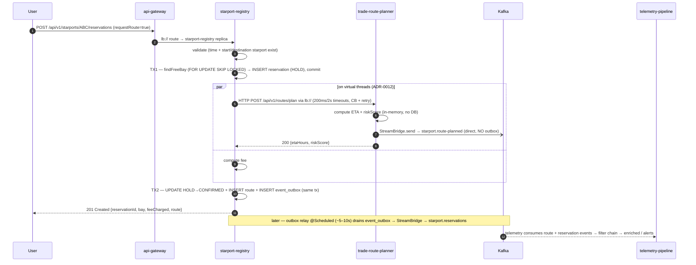
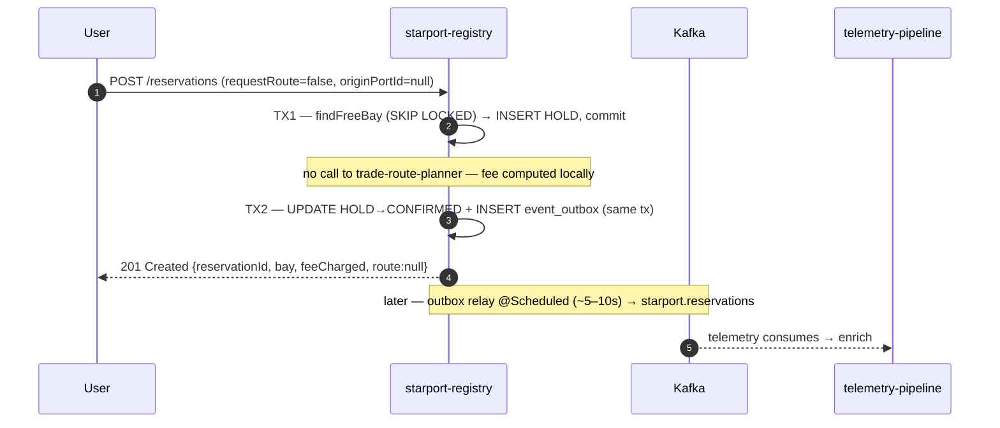
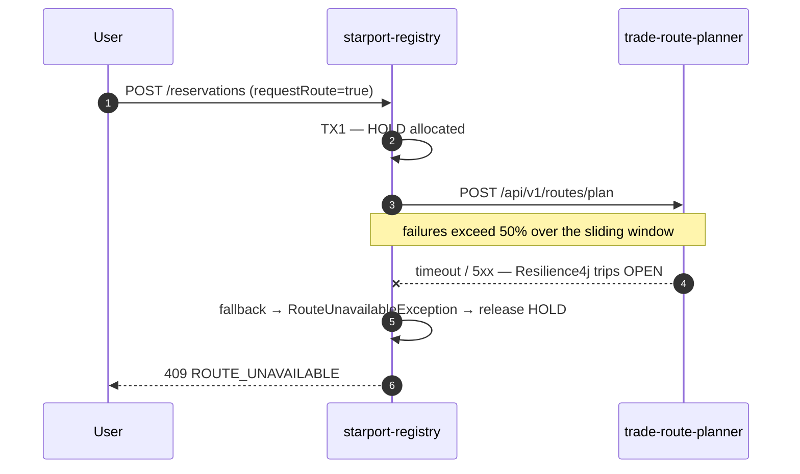
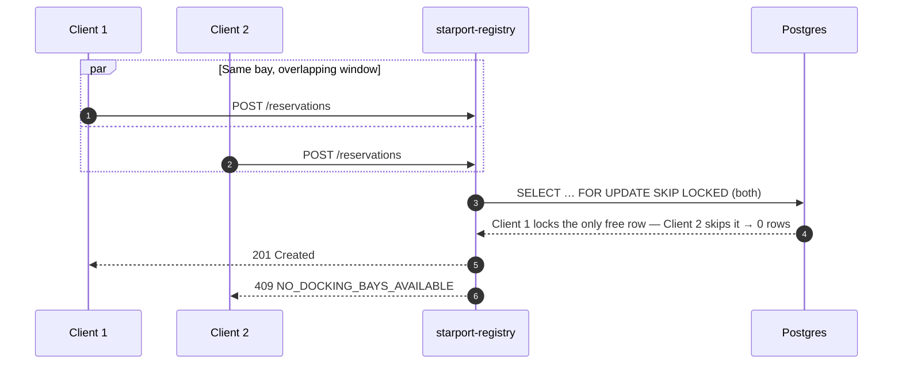
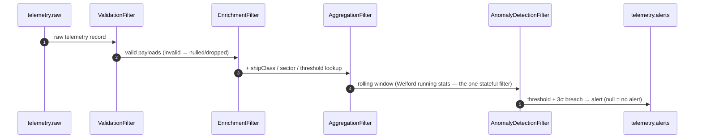

# 🪐 Sci-Fi Microservices Fleet

A **three-service microfleet** set in a galactic trade universe — a learning project that
demonstrates three different architecture styles, end-to-end distributed tracing, and a
production-shaped observability stack, all runnable from a single `docker compose up`.

> **Status — implemented & running.** All three business services run with ≥2 replicas,
> register in Eureka, sit behind a single Spring Cloud Gateway (`:8080`), produce/consume
> Kafka events, and are **fully observable** (metrics, traces, logs) through an OpenTelemetry
> Collector → Prometheus / Tempo / Loki pipeline. Every non-trivial decision is captured in
> **37 ADRs** (0000–0037) under [`adr/`](adr/README.md).

| | |
|---|---|
| **Runtime** | Java 21 · Virtual Threads |
| **Framework** | Spring Boot 3.5.6 · Spring Cloud 2025.0.0 |
| **Messaging** | Apache Kafka 3.7 (KRaft) · Spring Cloud Stream |
| **Data** | PostgreSQL 16 · Spring Data JPA · Flyway |
| **Observability** | OTel Collector · Prometheus · Grafana · Tempo · Loki · Alloy |
| **Build / QA** | Maven multi-module · Testcontainers · JUnit 5 · PIT · ArchUnit · Error Prone / NullAway · Spotless |

---

## 🚀 Quick Start

```bash
# From repo root:
cd infra/docker
docker compose up --build -d        # merges docker-compose.apps.yml + .observability.yml

# Wait for healthchecks (roughly 60–90 s on first run)
docker compose ps

# Smoke test — create a reservation (via the api-gateway on :8080)
curl -X POST http://localhost:8080/api/v1/starports/ABC/reservations \
  -H "Content-Type: application/json" \
  -d '{
    "customerCode": "CUST-001",
    "shipCode": "SS-Enterprise-01",
    "shipClass": "SCOUT",
    "startAt": "2031-05-01T10:00:00Z",
    "endAt":   "2031-05-01T11:00:00Z",
    "requestRoute": false,
    "originPortId": null
  }'
```

Tear down with `docker compose down` (add `-v` to also wipe Grafana / Prometheus / MinIO volumes).
Postgres is intentionally ephemeral (tmpfs) — every restart wipes the DB and Flyway replays the seed.

---

## 2. Tech Stack

| Concern | Technology | ADR |
|---|---|---|
| Language / Runtime | **Java 21** + Virtual Threads (Project Loom) | ADR-0012 |
| Framework | **Spring Boot 3.5.6** + **Spring Cloud 2025.0.0** | ADR-0025 |
| Service discovery | Netflix **Eureka** (standalone for dev) | ADR-0002, 0028 |
| Public ingress | **Spring Cloud Gateway** + Eureka (`lb://`) — single host-bound port | ADR-0031 |
| HTTP load balancing | **Spring Cloud LoadBalancer** (client-side, round-robin) | ADR-0003 |
| Sync HTTP resilience | **Resilience4j** circuit breaker + retry + short timeouts | ADR-0014 |
| Messaging | **Apache Kafka 3.7 (KRaft)** via Spring Cloud Stream (StreamBridge + functional beans) | ADR-0004, 0016, 0019 |
| Event delivery | Transactional **Outbox** + polling relay (at-least-once) | ADR-0010 |
| Persistence | **PostgreSQL 16** + Spring Data JPA + **Flyway** | ADR-0007, 0018 |
| Concurrency safety | `SELECT … FOR UPDATE SKIP LOCKED` + range-overlap query + `@Version` | ADR-0020 |
| Telemetry hub | **OTel Collector** (tail sampling for traces, 100% logs) | ADR-0037 |
| Metrics | Micrometer Observation API → **Prometheus** (+ Thanos long-term) | ADR-0005, 0030 |
| Traces | OTLP → Collector → **Tempo** | ADR-0017, 0037 |
| Logs | OTLP appender (apps) + **Alloy** (infra stdout) → **Loki** | ADR-0035, 0037 |
| Dashboards | **Grafana** (auto-provisioned) | ADR-0005, 0033 |
| Validation | Jakarta Bean Validation + Chain of Responsibility | ADR-0023 |
| Testing | **JUnit 5** + **Testcontainers** + `TestObservationRegistry` + **PIT** + **ArchUnit** | ADR-0006, 0029, 0011 |
| Build | Maven multi-module + BOM pinning + **Error Prone / NullAway** + **Spotless** | ADR-0025 |
| Container | Multi-stage Dockerfile (Temurin 21 JRE, container-aware JVM) | ADR-0026 |
| Deployment | Docker Compose (2 replicas per service) | ADR-0008 |

---

## 3. Domain — The Galactic Trade Network

A fictional interstellar logistics network. Each service models one bounded context and is built
with a **deliberately different architecture style** so the same project can demonstrate all three.

### Starport Registry — *Layered architecture*
The system of record for **starports, docking bays, customers, ships and reservations**. It owns the
only database, runs the pessimistic-locking reservation flow, calculates fees, and publishes domain
events through a transactional outbox. A classic **API → Application → Domain → Infrastructure**
layering fits because the logic is transaction- and persistence-centric.

### Trade Route Planner — *Hexagonal (Ports & Adapters)*
Computes legal/optimal **trade routes** (ETA + risk score) between star systems. It is called
synchronously by Starport Registry over `lb://` and emits `RoutePlanned` events. The **core domain
behind ports**, with REST and Kafka pushed out to adapters, keeps the routing logic framework-free
and easy to test in isolation.

### Telemetry Pipeline — *Pipes & Filters*
Ingests real-time starship **telemetry** and enriches/aggregates/scores it through a chain of
filters, raising alerts on anomalies. It also consumes the reservation and route events to produce
enriched streams. A **stateless filter chain** (one stateful aggregation stage) is the natural fit
for streaming transformation. **It has no REST API** and is not routed through the gateway.

---

## 4. System Architecture Diagram

```
                                   ┌─────────────────────────────┐
                          :8080    │        api-gateway          │   (only host-bound app port)
        User ───────────────────►  │  Spring Cloud Gateway (lb://)│
                                   └──────────────┬──────────────┘
                         /api/v1/starports/**     │   (no public route to the planner)
                                                  ▼
   ┌────────────────────────┐    HTTP  lb://trade-route-planner   ┌────────────────────────┐
   │   starport-registry    │ ─────────────────────────────────► │   trade-route-planner   │
   │   (×2 replicas, :8081) │   POST /api/v1/routes/plan          │   (×2 replicas, :8082)  │
   │                        │   (internal-only; no gateway route) │                         │
   └───────────┬────────────┘                                     └───────────┬────────────┘
               │ outbox → Kafka                                                │ Kafka
               │ starport.reservations                                        │ starport.route-planned
               └───────────────────────────────┬──────────────────────────────┘
                                                ▼
                                   ┌────────────────────────┐        telemetry.raw  ─────┐
                                   │   telemetry-pipeline    │  ◄────  (external producer)│
                                   │   (×2 replicas, :8090)  │  ───►  telemetry.alerts /  │
                                   └────────────────────────┘        enriched-* topics    │
                                                                                          
   ── all services ──►  OTel Collector :4318  ──►  tail-sample ──►  Tempo (traces)
                                              └──►  100%        ──►  Loki  (logs)
   Prometheus :9090  ──►  scrapes each service's /actuator/prometheus
   Alloy  ──►  scrapes INFRA container stdout (kafka, postgres, grafana…) ──►  Loki
```

Every business service registers with **Eureka** (`:8761`); the gateway and Starport Registry
resolve targets via `lb://service-name`, so no client ever learns an instance-specific URL.

### Service dependency map

Who depends on whom at **runtime** (a service will not become healthy until its hard dependencies are up — `depends_on: service_healthy` in Compose):

| Service | Hard runtime deps | Talks to (purpose) |
|---|---|---|
| **api-gateway** | eureka, otel-collector | → starport-registry (HTTP via `lb://`). Does **not** route to trade-route-planner — planner is internal-only |
| **starport-registry** | eureka, **postgres**, kafka, otel-collector | → trade-route-planner (HTTP `lb://`); → Kafka (outbox publish); ← Postgres (only DB owner) |
| **trade-route-planner** | eureka, kafka, otel-collector | → Kafka (direct `StreamBridge` publish); **no DB** — ETA/risk computed in-memory |
| **telemetry-pipeline** | eureka, kafka, otel-collector | ← Kafka (consumes `telemetry.raw`, `starport.reservations`, `starport.route-planned`); → Kafka (alerts/enriched); **no DB, no REST API** |
| **eureka** | — | registry for all of the above |
| **otel-collector** | tempo, loki | ← all apps (OTLP traces + logs); → Tempo, → Loki |
| **prometheus** | — | scrapes every app's `/actuator/prometheus` (pull) |
| **alloy** | loki | scrapes **infra** container stdout → Loki |

**Direction of coupling.** The only synchronous service-to-service call is **starport-registry → trade-route-planner** (HTTP). Everything else is **asynchronous via Kafka** and one-directional: producers never wait for telemetry. telemetry-pipeline is a pure sink/transformer — nothing calls back into it.

**Build-time dependency:** all modules inherit the root `pom.xml` (`gt-parent`), which pins Spring Boot, Spring Cloud, the Micrometer/OTel BOMs and the shared OTLP logback appender (ADR-0025, ADR-0037).

### Request lifecycle — when DB, Kafka and filters actually fire

A single `requestRoute=true` reservation, step by step (verified against the code):

1. **HTTP in.** `api-gateway` matches `/api/v1/starports/**`, resolves a live `starport-registry` replica via Eureka + LoadBalancer, forwards the request. `ReservationController.create()` maps the JSON to a command.
2. **Validation (no I/O writes).** `ReserveBayValidationService` runs the Chain of Responsibility: time validity → start-starport exists → destination-starport exists.
3. **DB write #1 — TX1 (HOLD).** `CreateHoldReservationService` (own `@Transactional`) runs `SELECT … FOR UPDATE SKIP LOCKED` to grab a free bay, then `INSERT`s the reservation in status `HOLD`. **This transaction commits on its own** before the external call.
4. **Parallel fee + route (virtual threads).** `reservationCalculationFacade` fans out on virtual threads (ADR-0012): one branch calls `trade-route-planner` over HTTP (`POST /api/v1/routes/plan`, 200 ms/2 s timeouts, wrapped in `@CircuitBreaker` + `@Retry`); the other computes the fee. The planner computes ETA + riskScore **in memory (no DB)** and publishes `RoutePlanned` to `starport.route-planned` with a **direct `StreamBridge.send()` — no outbox**, synchronously inside the `/plan` call.
5. **DB write #2 — TX2 (CONFIRM + outbox).** `ConfirmReservationService` (own `@Transactional`) updates the reservation `HOLD → CONFIRMED`, writes the `route` row, and in the **same transaction** `OutboxAppender` `INSERT`s a `ReservationConfirmed` row into `event_outbox`. **No Kafka call happens here.** If anything between TX1 and TX2 fails, a `finally` block releases the HOLD (compensation).
6. **HTTP out.** `201 Created` returns to the user — Kafka publication of the reservation event has **not** happened yet.
7. **Async Kafka publish.** A scheduled relay (`InboxPublisher.pollAndPublish`, `@Scheduled` ~5–10 s) drains `event_outbox` and `StreamBridge.send()`s each row to `starport.reservations`, marking it `SENT`. This is the **at-least-once** boundary (ADR-0010).
8. **Filters run.** For **every** message on `starport.reservations` / `starport.route-planned` / `telemetry.raw`, telemetry-pipeline applies the matching Spring Cloud Function. The main `telemetryPipeline` is a composed chain (`validation → enrichment → aggregation → anomaly`, `Function.andThen`): a `null` from any stage short-circuits the rest (message dropped), each stage is timed (`telemetry.filter.*`), and only `AggregationFilter` holds state (per-`(ship,sensor)` Welford windows). A non-null `AnomalyAlert` is published to `telemetry.alerts`.

> **The two key timing facts:** (a) in starport-registry, **Kafka is never published in the request thread** — only an outbox row is written; a background relay publishes later. (b) trade-route-planner has **no outbox** — it publishes `RoutePlanned` directly and synchronously while planning.

---

## 5. Process Flows

### Flow A — Reserve docking bay + route planning (happy path)


```mermaid
sequenceDiagram
    autonumber
    participant U as User
    participant G as api-gateway
    participant A as starport-registry
    participant B as trade-route-planner
    participant K as Kafka
    participant C as telemetry-pipeline

    U->>G: POST /api/v1/starports/ABC/reservations (requestRoute=true)
    G->>A: lb:// route → starport-registry replica
    A->>A: validate (time + start/destination starport exist)
    A->>A: TX1 — findFreeBay (FOR UPDATE SKIP LOCKED) → INSERT reservation (HOLD), commit
    par on virtual threads (ADR-0012)
        A->>B: HTTP POST /api/v1/routes/plan via lb:// (200ms/2s timeouts, CB + retry)
        B->>B: compute ETA + riskScore (in-memory, no DB)
        B-)K: StreamBridge.send → starport.route-planned (direct, NO outbox)
        B-->>A: 200 {etaHours, riskScore}
    and
        A->>A: compute fee
    end
    A->>A: TX2 — UPDATE HOLD→CONFIRMED + INSERT route + INSERT event_outbox (same tx)
    A-->>U: 201 Created {reservationId, bay, feeCharged, route}
    Note over A,K: later — outbox relay @Scheduled (~5–10s) drains event_outbox → StreamBridge → starport.reservations
    K-->>C: telemetry consumes route + reservation events → filter chain → enriched / alerts
```

### Flow B — Reserve docking bay, no route (`requestRoute: false`)


```mermaid
sequenceDiagram
    autonumber
    participant U as User
    participant A as starport-registry
    participant K as Kafka
    participant C as telemetry-pipeline

    U->>A: POST /reservations (requestRoute=false, originPortId=null)
    A->>A: TX1 — findFreeBay (SKIP LOCKED) → INSERT HOLD, commit
    Note over A: no call to trade-route-planner — fee computed locally
    A->>A: TX2 — UPDATE HOLD→CONFIRMED + INSERT event_outbox (same tx)
    A-->>U: 201 Created {reservationId, bay, feeCharged, route:null}
    Note over A,K: later — outbox relay @Scheduled (~5–10s) → starport.reservations
    K-->>C: telemetry consumes → enrich
```

### Flow C — Circuit breaker open (route unavailable)


```mermaid
sequenceDiagram
    autonumber
    participant U as User
    participant A as starport-registry
    participant B as trade-route-planner

    U->>A: POST /reservations (requestRoute=true)
    A->>A: TX1 — HOLD allocated
    A->>B: POST /api/v1/routes/plan
    Note over A,B: failures exceed 50% over the sliding window
    B--xA: timeout / 5xx — Resilience4j trips OPEN
    A->>A: fallback → RouteUnavailableException → release HOLD
    A-->>U: 409 ROUTE_UNAVAILABLE
```

### Flow D — Concurrent reservation conflict


```mermaid
sequenceDiagram
    autonumber
    participant U1 as Client 1
    participant U2 as Client 2
    participant A as starport-registry
    participant DB as Postgres

    par Same bay, overlapping window
        U1->>A: POST /reservations
        and
        U2->>A: POST /reservations
    end
    A->>DB: SELECT … FOR UPDATE SKIP LOCKED  (both)
    DB-->>A: Client 1 locks the only free row — Client 2 skips it → 0 rows
    A-->>U1: 201 Created
    A-->>U2: 409 NO_DOCKING_BAYS_AVAILABLE
```

### Flow E — Telemetry pipeline (Pipes & Filters)


```mermaid
sequenceDiagram
    autonumber
    participant K as telemetry.raw
    participant V as ValidationFilter
    participant E as EnrichmentFilter
    participant Ag as AggregationFilter
    participant An as AnomalyDetectionFilter
    participant Out as telemetry.alerts

    K->>V: raw telemetry record
    V->>E: valid payloads (invalid → nulled/dropped)
    E->>Ag: + shipClass / sector / threshold lookup
    Ag->>An: rolling window (Welford running stats — the one stateful filter)
    An->>Out: threshold + 3σ breach → alert (null = no alert)
```

---

## 6. HTTP API Reference

### `POST /api/v1/starports/{code}/reservations` — external, via gateway `:8080`

Creates (HOLD → CONFIRM) a docking-bay reservation, optionally planning a route.

**Request** (`ReservationCreateRequest`, Jakarta-validated — ADR-0023):

```json
{
  "customerCode": "CUST-001",
  "shipCode": "SS-Enterprise-01",
  "shipClass": "SCOUT",
  "startAt": "2031-05-01T10:00:00Z",
  "endAt":   "2031-05-01T11:00:00Z",
  "requestRoute": true,
  "originPortId": "ALPHA-BASE"
}
```

| Field | Type | Constraint |
|---|---|---|
| `customerCode` | string | required, non-blank, must exist |
| `shipCode` | string | required, non-blank, must exist |
| `shipClass` | enum | required — `SCOUT` / `FREIGHTER` / `CRUISER` |
| `startAt` / `endAt` | ISO-8601 UTC | required, future, `startAt < endAt` |
| `requestRoute` | boolean | required |
| `originPortId` | string \| null | required when `requestRoute=true` |

**Response 201 Created** (`ReservationResponse`):

```json
{
  "reservationId": 42,
  "starportCode": "ABC",
  "bayNumber": 7,
  "startAt": "2031-05-01T10:00:00Z",
  "endAt":   "2031-05-01T11:00:00Z",
  "feeCharged": 1480.00,
  "route": { "routeCode": "ROUTE-9F21", "etaHours": 18.7, "riskScore": 0.32 }
}
```

**Error responses** (ADR-0015 — stable `error` codes):

| Status | `error` code | Cause |
|---|---|---|
| 400 | `MALFORMED_REQUEST` | Invalid/broken JSON, wrong type, unknown `shipClass` value |
| 404 | `STARPORT_NOT_FOUND` / `CUSTOMER_NOT_FOUND` / `SHIP_NOT_FOUND` | Unknown reference code |
| 409 | `NO_DOCKING_BAYS_AVAILABLE` | Pessimistic lock returned 0 rows (ADR-0020) |
| 409 | `ROUTE_UNAVAILABLE` | Circuit breaker open on trade-route-planner (ADR-0014) |
| 415 | *(unsupported media type)* | Empty body / missing `Content-Type` |
| 422 | `VALIDATION_FAILED` | Bean Validation rejected the payload (missing/blank field) |
| 422 | `INVALID_RESERVATION_TIME` | Rule chain: `startAt >= endAt`, past dates |

### `POST /api/v1/routes/plan` — trade-route-planner

The route-planning contract. **Server-to-server only:** Starport Registry calls it via
`http://trade-route-planner/api/v1/routes/plan` (resolved by `lb://`) during reservation
confirmation. It is **not** exposed through the gateway — there is no public route for
`/api/v1/routes/**`, and the planner binds no host port, so it is unreachable from outside
the `app` network (ADR-0031).

The planner is **stateless and DB-free** — ETA is derived from ship class, riskScore from a deterministic corridor hash. On success it publishes `RoutePlanned` to `starport.route-planned` via a **direct `StreamBridge.send()`** (no outbox).

**Request** (`PlanRouteRequest`):

```json
{
  "originPortId": "ALPHA-BASE",
  "destinationPortId": "ABC",
  "shipProfile": { "shipClass": "SCOUT", "fuelRangeLY": 24.0 }
}
```

**Response 200 OK** (`PlanRouteResponse`):

```json
{ "routeId": "ROUTE-9F21", "etaHours": 18.7, "riskScore": 0.32, "correlationId": "…" }
```

**Caller-side resilience (from `starport-registry/application.yml`):**

| Parameter | Value |
|---|---|
| Connect timeout | `200 ms` |
| Read timeout | `2000 ms` |
| Circuit breaker | sliding window 10, min 5 calls, 50% failure threshold, open 10 s, half-open 3 |
| Retry | `max-attempts: 2` (one retry), `100 ms` wait, on `RouteUnavailableException` |

### Other endpoints

- **Actuator** on every service: `/actuator/health`, `/info`, `/metrics`, `/prometheus`, `/liveness`, `/readiness`.
- **Gateway**: `/actuator/gateway/routes` lists the active routing rules.
- **telemetry-pipeline** has no business REST API — it is Kafka-driven only.

---

## 7. Kafka Topology

Namespaces: `starport.*` (owned by starport-registry + trade-route-planner) and `telemetry.*`
(owned by telemetry-pipeline). Topic destinations are the wire contract; binding names are the
Spring Cloud Stream function bindings.

| Topic | Producer (binding) | Consumer (binding) | Partitions | Retry | DLQ |
|---|---|---|---|---|---|
| `starport.reservations` | starport-registry (`reservationConfirmed-out-0`) | telemetry-pipeline (`reservationPipeline-in-0`) | 3 | 3 × 1 s | `starport.reservations.dlq` |
| `starport.route-planned` | trade-route-planner (`routePlanned-out-0`) | telemetry-pipeline (`routePipeline-in-0`) | default (2) | 3 × 1 s | `starport.route-planned.dlq` |
| `telemetry.raw` | *(external producer)* | telemetry-pipeline (`telemetryPipeline-in-0`) | default (2) | 3 × 1 s | `telemetry.raw.dlq` |
| `telemetry.alerts` | telemetry-pipeline (`telemetryPipeline-out-0`) | — | default (2) | — | — |
| `telemetry.enriched-reservations` | telemetry-pipeline (`reservationPipeline-out-0`) | — | default (2) | — | — |
| `telemetry.enriched-routes` | telemetry-pipeline (`routePipeline-out-0`) | — | default (2) | — | — |

> Topics are auto-created on first publish (`autoCreateTopics: true`). The default partition count
> is `2` (broker `KAFKA_NUM_PARTITIONS`); `starport.reservations` is grown to **3** via
> `autoAddPartitions: true` on the producer (ADR-0019).

**Delivery guarantee.** The two producers differ by design:
- **starport-registry → `starport.reservations`** uses a **transactional outbox** — the event row is
  written in the same DB transaction as the reservation, then drained to Kafka by a polling relay
  (`InboxPublisher`, ~5–10 s) — giving **at-least-once** delivery even across crashes (ADR-0010).
- **trade-route-planner → `starport.route-planned`** has no database, so it publishes **directly and
  synchronously** via `StreamBridge.send()` inside the `/plan` call (no outbox; a failed send throws).

Telemetry consumers are idempotent where semantics require it and route poison/deserialization
failures to per-binding **DLQ** topics after `max-attempts: 3`.

---

## 8. Database Schema (starport-registry only)

Only `starport-registry` has a database (ADR-0018). DDL lives in
`starport-registry/src/main/resources/db/migration/` as Flyway versioned migrations:

| Migration | Purpose |
|---|---|
| `V1__starport_basic_model.sql` | Core aggregates + ID sequences (`INCREMENT BY 10`, pooled-lo) |
| `V2__test_data.sql` | Baseline seed (starports `ABC` / `ALPHA-BASE`, `CUST-001`, `SS-Enterprise-01`, bays) |
| `V3__create_event_outbox.sql` | `event_outbox` table + `(status, created_at)` index |
| `V4__reservation_indexes.sql` | Composite indexes for the `findFreeBay` hot path |
| `V6__lookup_indexes.sql` | Indexes on `code` columns (starport / customer / ship) |
| `V7__reservation_optimistic_lock.sql` | Adds `reservation.version` for `@Version` optimistic locking |

Core tables (IDs are `BIGINT` from per-table sequences; `event_outbox` uses `GENERATED BY DEFAULT AS IDENTITY`):

- **`starport`** — `code`, `name`, `description`, `created_at`, `updated_at`.
- **`docking_bay`** — `starport_id`, `bay_label`, `ship_class`, `status`. Target of the
  `FOR UPDATE SKIP LOCKED` lock (ADR-0020).
- **`customer`** — `customer_code`, `name`, timestamps.
- **`ship`** — `customer_id`, `ship_code`, `ship_class`.
- **`reservation`** — `starport_id`, `docking_bay_id`, `customer_id`, `ship_id`, `start_at`,
  `end_at`, `fee_charged` (`NUMERIC(14,2)`), `status` (`HOLD` / `CONFIRMED` / `CANCELLED`),
  `route_id`, `version`, timestamps. Overlap is checked against `(start_at, end_at)`.
- **`route`** — `reservation_id`, `route_code`, `start_port_code`, `destination_port_code`,
  `eta_light_years`, `risk_score` (one row per reservation when `requestRoute=true`).
- **`event_outbox`** — `event_type`, `binding`, `message_key`, `payload_json` (JSONB),
  `headers_json` (JSONB), `status` (`PENDING` / `SENT` / `FAILED`), `attempts`, `created_at`,
  `sent_at`. Drained by the outbox relay (ADR-0010).

The query that makes reservation concurrency safe:

```sql
-- ADR-0020: pick a free bay and lock it; concurrent callers SKIP the locked row.
SELECT db.* FROM docking_bay db
WHERE db.starport_id = :starportId
  AND db.ship_class  = :shipClass
  AND db.status = 'ACTIVE'
  AND NOT EXISTS (
      SELECT 1 FROM reservation r
      WHERE db.id = r.docking_bay_id
        AND r.start_at < :endAt AND r.end_at > :startAt
  )
LIMIT 1
FOR UPDATE SKIP LOCKED;
```

**No foreign keys by design (ADR-0018).** Every `*_id` is a plain `BIGINT` with a
`-- references X.id (no FK by design)` comment. The trade-off: insert-order-independent test
seeding at the cost of DB-level referential integrity; the application layer
(`ReserveBayValidationService` — ADR-0023) enforces existence before any write.

---

## 9. Observability Stack

Apps push **traces** and **logs** over OTLP to a single **OTel Collector** (`otel-collector:4318`) —
never directly to Tempo or Loki. The Collector is the central hub (ADR-0037).

### Traces

Spring Boot (micrometer-tracing-bridge-otel) exports **100% of spans** over OTLP to the Collector
(`management.tracing.sampling.probability: 1.0` — every span reaches the Collector; the Collector
decides what to keep). The Collector applies **tail sampling**:

| Policy | Keep |
|---|---|
| `keep-errors` (status_code) | 100% of traces with any ERROR span |
| `keep-slow` (latency) | 100% of traces slower than **2 s** |
| `baseline-1pct` (probabilistic) | **1%** of everything else |

`decision_wait: 10 s` buffers all spans of a trace before deciding (covers e2e latency + the
~5 s BatchSpanProcessor flush). Kept traces are written to **Tempo**. Trace context propagates over
HTTP (LoadBalancer auto-instrumentation) and over Kafka via `enable-observation: true` on every
binder (ADR-0017). Business IDs `reservationId` / `routeId` ride in OpenTelemetry baggage.

### Metrics

Micrometer Observation API exposes `/actuator/prometheus`; **Prometheus** scrapes each replica.
Histograms are activated by the presence of `slo:` buckets (no client-side percentiles — they don't
aggregate across replicas; use `histogram_quantile()` over `_bucket` in PromQL). Long-term storage
is offloaded to **Thanos** (Prometheus keeps only 6 h locally; sidecar → MinIO → store/query).

Representative custom metrics (ADR-0030, two-tier cardinality):

| Metric | Type | Tags |
|---|---|---|
| `reservations.hold.allocate` | Timer + histogram | — |
| `reservations.fees.calculate` | Timer | — |
| `reservations.route.plan` | Timer | — |
| `reservations.confirm` | Timer | — |
| `reservations.outbox.append` | Timer | — |
| `reservations.inbox.publish` / `inbox.poll.duration` | Timer | — |
| `reservations.created.total` | Counter | `starport`, `shipClass`, `outcome` |
| `reservations.outbox.dead.letter` | Counter | `eventType`, `binding` |
| `routes.plan` | Timer + histogram | (planner) |
| `telemetry.filter.{validation,enrichment,aggregation,anomaly}` | Timer | (per stage) |
| `telemetry.anomalies.detected` | Counter | `severity` |
| `events.reservation.lag` | Timer | end-to-end produce→consume lag |

### Logs

- **Apps** → OTel logback appender → OTLP → **OTel Collector** → **Loki** (**100%, no sampling** —
  the only sure guarantee that "trace in Tempo ⇒ log in Loki").
- **Infra** (kafka, postgres, grafana, prometheus, tempo, loki, kafka-ui, otel-collector) → **Grafana Alloy**
  scrapes Docker stdout → Loki. Alloy explicitly **drops** the application containers (they already
  push OTLP) — see `alloy/config.alloy`.
- **Label convention:** `service_name` (native OTLP→Loki mapping from the `service.name` resource
  attribute; Alloy mirrors it for infra — ADR-0037 §B1).
- **Trace correlation:** every log line carries `[service, traceId, spanId]`, so Grafana's
  "Logs for this span" button jumps straight from a trace to its logs.

### Grafana dashboards

Auto-provisioned under `infra/docker/grafana/provisioning/dashboards/`:

- **`distributed_tracing.json`** — request rate, HTTP latency p50/p95/p99, error rate,
  circuit-breaker state, async outbox/inbox tracing, Tempo explorer, service dependency graph.
- **`business-revenue-executive.json`** — executive revenue view: total/▵ revenue, revenue per port
  & ship class, avg revenue per reservation, rejection rate, live dock occupancy.
- **`slo-error-budget.json`** — availability & latency SLOs with 30-day error-budget burn-rate and
  top budget consumers (5xx by service / endpoint).
- **`resources_use.json`** — USE method (Utilization · Saturation · Errors) for JVM, Hikari, Kafka
  client, and the outbox queue. (Under virtual threads `tomcat_threads_*` is unreliable — web
  saturation is read from `http_server_requests_active_seconds_count`.)
- **`exemplars-success-error.json`** — success/error drill-down with exemplars linking latency
  histograms to the originating traces (ADR-0033).

---

## 10. URL Reference

Only the **api-gateway** binds a host port for business traffic; app replicas live on the internal
`app` network and are reached via Eureka-resolved `lb://` URIs (ADR-0031).

| Component | URL | Notes |
|---|---|---|
| **api-gateway** (public ingress) | http://localhost:8080 | `/api/v1/starports/**` → starport-registry. The planner is **not** routed — `/api/v1/routes/**` is internal-only |
| Gateway routes | http://localhost:8080/actuator/gateway/routes | List active routing rules |
| Eureka dashboard | http://localhost:8761 | Service registry UI; live replicas per service |
| Kafka UI | http://localhost:8085 | Topic / consumer-group browser |
| Kafka bootstrap | `localhost:9092` (TCP) | Host clients (Postman / IDE); containers use `kafka:9093` |
| PostgreSQL | `localhost:5432` (`starports`, `postgres`/`postgres`) | Dev DB access (ephemeral tmpfs) |
| **OTel Collector** | `localhost:4318` (HTTP) / `4317` (gRPC) | OTLP traces + logs in (host/IDE runs) |
| Prometheus | http://localhost:9090 | Metrics scrape (6 h local retention) |
| Thanos Query | http://localhost:10902 | Long-term / global metrics view |
| MinIO console | http://localhost:9001 | Thanos object store (creds from `.env`) |
| Grafana | http://localhost:3000 (`admin`/`admin`) | Unified Prometheus + Tempo + Loki dashboards |
| Tempo | http://localhost:3200 | Trace API (OTLP `:4318` is internal-only now — ADR-0037) |
| Loki | http://localhost:3100 | Log aggregation |
| Alloy | http://localhost:12345 | Debug UI (infra-log scraper only) |

App instances (`starport-registry-1/2` :8081, `trade-route-planner-1/2` :8082,
`telemetry-pipeline-1/2` :8090) have **no host port binding**. Debug a single instance via:

```bash
docker compose exec starport-registry-1 wget -qO- http://localhost:8081/actuator/health
```

---

## 11. Project Structure

```
MicroservicesFleet/
├── adr/                            # 37 ADRs (0000–0037) + template + index
├── api-gateway/                    # Spring Cloud Gateway — single public ingress (:8080, ADR-0031)
├── eureka-server/                  # Netflix Eureka registry (:8761) — @EnableEurekaServer wrapper
├── starport-registry/              # Layered — reservations, fees, outbox publisher
│   └── src/main/java/com/galactic/starport/
│       ├── controller/             # REST + DTO records + GlobalExceptionHandler
│       ├── service/                # holdreservation / confirmreservation / feecalculator /
│       │                           #   routeplanner / validation (ADR-0023) / outbox (ADR-0010)
│       ├── repository/             # JPA entities + ReservationMapper (ADR-0024)
│       └── config/                 # @Configuration beans (RestClient, aspects)
├── trade-route-planner/            # Hexagonal — route planning (:8082)
│   └── src/main/java/com/galactic/traderoute/
│       ├── domain/model/           # Pure records (ADR-0021)
│       ├── port/{in,out}/          # Driving + driven ports
│       ├── application/            # Use-case services
│       └── adapter/{in/rest,out/kafka}/  # Framework code lives here only
├── telemetry-pipeline/             # Pipes & Filters (:8090) — no REST API
│   └── src/main/java/com/galactic/telemetry/
│       ├── model/                  # Records — one per pipeline stage (ADR-0022)
│       ├── filter/                 # Function<IN,OUT> filters (stateless + 1 stateful)
│       ├── pipeline/               # @Configuration composing the function chain
│       └── config/                 # Threshold @ConfigurationProperties
├── infra/docker/                   # Compose stack
│   ├── docker-compose.yml          # include: apps + observability
│   ├── docker-compose.apps.yml     # eureka, postgres, kafka, gateway, app ×2 each
│   ├── docker-compose.observability.yml  # tempo, prometheus, loki, alloy, grafana, otel-collector, thanos, minio
│   ├── otel-collector/collector.yaml     # OTLP receivers + tail sampling pipelines (ADR-0037)
│   ├── alloy/config.alloy          # infra-stdout scraper → Loki (ADR-0037)
│   ├── grafana/                    # provisioning + tempo.yml / loki config
│   ├── prometheus/                 # scrape config
│   └── thanos/                     # objstore.yml (MinIO)
├── scripts/                        # load-test.ps1 / load-test-all.ps1
├── plany/                          # throughput / concurrency design notes
├── pom.xml                         # Aggregator (BOMs + plugins — ADR-0025)
└── README.md                       # You are here
```

---

## 12. Environment Variables

All services follow the `${ENV_VAR:default}` pattern (ADR-0009). Compose sets these per container;
`./mvnw spring-boot:run` falls back to `localhost` defaults.

| Variable | Default | Scope |
|---|---|---|
| `PORT` | `8080` gateway / `8081` starport / `8082` planner / `8090` telemetry / `8761` eureka | all services |
| `DB_URL` | `jdbc:postgresql://localhost:5432/starports` | starport-registry only |
| `DB_USER` / `DB_PASS` | `postgres` / `postgres` | starport-registry only |
| `KAFKA_BROKERS` | `localhost:9092` (Compose: `kafka:9093`) | all app services |
| `EUREKA_URL` | `http://localhost:8761/eureka` (Compose: `http://eureka:8761/eureka`) | all app services |
| `OTEL_EXPORTER_OTLP_TRACES_ENDPOINT` | `http://otel-collector:4318/v1/traces` | all app services |
| `OTEL_EXPORTER_OTLP_LOGS_ENDPOINT` | `http://otel-collector:4318/v1/logs` | all app services |
| `OTEL_BSP_SCHEDULE_DELAY` | `1000` (best-effort BSP flush; may be ignored — see ADR-0037 §B2) | all app services |
| `TRACE_SAMPLING` | `1.0` (all spans to Collector; the Collector tail-samples) | all app services |
| `MINIO_ROOT_USER` / `MINIO_ROOT_PASSWORD` | from `.env` (dev: `minio` / `minio123`) | MinIO / Thanos |

> The `localhost` default for `OTEL_EXPORTER_OTLP_*` is `http://localhost:4318/...` (set in each
> `application.yml`); the Collector publishes host port `4318`, so IDE runs export to the same hub.
> Secrets must be passed only through environment variables — never committed to YAML.

---

## Load Testing

```powershell
# 100 interleaved requests (50 good + 50 bad) at one non-overlapping time band; default -Base is :8080
powershell -ExecutionPolicy Bypass -File scripts/load-test.ps1 -ScriptId 1

# Fan-out: 5 scripts in parallel, non-overlapping day bands (500 total requests)
powershell -ExecutionPolicy Bypass -File scripts/load-test-all.ps1
```

Expected aggregate: ~250 `201 Created` + ~250 deliberate client errors (`400/404/409/415/422`).
A mismatch count > 0 signals a behaviour regression.

---

## Architecture Decision Records

**37 ADRs (0000–0037)** live in [`adr/`](adr/README.md) with per-concern and per-service maps.
Current authorities to note:

- **ADR-0037 — tail sampling in the OTel Collector** is the current observability authority.
  It **supersedes** the log-sampling chain **0034 ← 0035 ← 0037** and the dual-sink design
  **0036 ← 0037**; treat 0034/0035/0036 as historical only.
- Traces are tail-sampled (errors 100% · latency > 2 s 100% · rest 1%); **logs are not sampled**
  (100% to Loki).
- Application logs go via the OTLP logback appender → OTel Collector → Loki. **Alloy handles infra
  container stdout only** (it does not tail application stdout).

> New architectural decisions must ship with an ADR — see [`adr/0000-template.md`](adr/0000-template.md).
```
