# 🪐 Sci-Fi Microservices Fleet

Hey space cadet! 🚀  
Mission is to design and implement a **three-service microfleet** set in a sci-fi universe. Each service uses a **different architecture style**:

1. **Layered architecture**
2. **Hexagonal (Ports & Adapters)**
3. **Pipes & Filters**

All services must run **at least 2 instances** each, use **HTTP service discovery** for synchronous calls, and ship with **observability** + **tests** (unit, integration, architecture).

Stack: **Java 21, Spring Boot 3.x, Spring Cloud, Micrometer Tracing**

---

## 🎯 Mission Goals

1. Three independent microservices with **clear boundaries** and style-appropriate internals
2. **Service discovery** for HTTP (Eureka or Consul)
3. **Observability** (traces, metrics, logs) from day zero
4. **Tests:** unit, integration (Testcontainers), architecture (ArchUnit)
5. **Run ≥2 instances** of each service (Docker Compose or K8s)
6. **ADRs for *every* architecture decision**

---

## 🧭 The Sci-Fi Domain

We’re building a **Galactic Trade Network**:

### 1) **Starport Registry** — *Layered architecture*
Tracks starports, docking bays, fees, and availability.
- Layers: **API** → **Application** → **Domain** → **Infrastructure**

### 2) **Trade Route Planner** — *Hexagonal architecture*
Computes legal and optimal trade routes across star systems.
- **Core domain** behind ports
- Adapters for persistence, embargo lists, astro charts

### 3) **Telemetry Pipeline** — *Pipes & Filters*
Processes real-time starship telemetry: enrich, aggregate, detect anomalies.
- Stateless filters connected in a chain

---

## 🔧 Tech Requirements

- **Java 21+, Spring Boot 3.x, Maven**
- **Spring Cloud** (Discovery + LoadBalancer)
- **Micrometer Tracing** + OTLP exporter (Jaeger/Zipkin/Tempo)
- **Prometheus + Actuator** for metrics
- **Testcontainers** for Postgres/Kafka/Eureka
- **ArchUnit** for architecture rules
- Deployment: **Docker Compose** (scale services) or **K8s with replicas: 2**

---

## 📐 Architecture Style Requirements

### Starport Registry — **Layered**
- REST controllers → service layer → domain → Spring Data JPA
- Example: `POST /starports/{id}/reserve-bay`

### Trade Route Planner — **Hexagonal**
- Core domain with **ports** (use cases) and **adapters**
- Adapters: REST (API), Postgres (persistence), HTTP clients (embargo/astro data)

### Telemetry Pipeline — **Pipes & Filters**
- Kafka topic → `ValidationFilter` → `EnrichmentFilter` → `AggregationFilter` → `AnomalyDetectionFilter` → sinks
- Implement with **Spring Cloud Stream**

---

## 🔌 Service Discovery & Networking

- Stand up **Eureka Server** (or Consul)
- Each service registers itself
- HTTP calls use **`lb://service-name`** (Spring Cloud LoadBalancer)
- Each service runs in **≥2 instances**

---

## 👀 Observability

- Micrometer Tracing + Propagation over HTTP & Kafka
- `/actuator/prometheus` for metrics
- Custom metrics:
    - `starport.reservations.count`
    - `routes.planned.count`
    - `telemetry.anomalies.detected`

---

## 🧪 Testing Strategy

- **Unit tests** for domain logic
- **Integration tests** with Testcontainers (Postgres, Kafka, Eureka)
- **ArchUnit rules** per style
- **Contract tests** (Spring Cloud Contract optional)

---

## 📄 ADRs (Architecture Decision Records)

Create ADRs for every major decision. Suggested:

1. **Architecture styles** (Layered, Hexagonal, Pipes & Filters)
2. **Service discovery** choice
3. **HTTP load balancing** approach
4. **When to use messaging vs HTTP**
5. **Observability stack**
6. **Testing strategy**
7. **Database choice**
8. **Deployment topology**
9. **Configuration management**
10. **Resilience patterns**

---

# 🧭 System Integration Guide — Starport Registry (A), Trade Route Planner (B), Telemetry Pipeline (C)

## Topology & Roles

- **Service A — Starport Registry (Layered)**  
  **Calls**: Service B over HTTP (service discovery).  
  **Emits**: `StarportReservationCreated`, `TariffCalculated`, `IncidentRecorded` …

- **Service B — Trade Route Planner (Hexagonal)**  
  **Called by**: A (HTTP).  
  **Emits**: `RoutePlanned`, `RouteReplanned`, `RouteRejected` …

- **Service C — Telemetry Pipeline (Pipes & Filters)**  
  **Consumes**: events from A & B.  
  **Publishes**: enriched events (`*.enriched`) & alerts.

---

## High-Level Flows

### Flow 1 — Reserve Docking Bay & Plan a Route

```mermaid
sequenceDiagram
    autonumber
    participant U as User
    participant A as Starport Registry
    participant B as Trade Route Planner
    participant K as Kafka/Redpanda
    participant C as Telemetry Pipeline

    U->>A: POST /starports/{id}/reservations
    A->>B: HTTP POST /routes/plan via lb://
    A-->>K: Event: StarportReservationCreated
    B-->>K: Event: RoutePlanned
    K-->>C: Consume both events
    C->>C: validate → enrich → aggregate → detect anomaly
    C-->>K: Publish enriched events
    A-->>U: 201 Created + reservationId + route ETA
```



### Flow 2 — Dynamic Re-Route


---

## HTTP Contracts

### A → B: Plan Route
`POST http://lb://trade-route-planner/routes/plan`

**Request**
```json
{
  "originPortId": "SP-77-NARSHADDA",
  "destinationPortId": "SP-02-TATOOINE-MOS",
  "shipProfile": { "class": "FREIGHTER_MK2", "fuelRangeLY": 24.0 }
}
```

**Response**
```json
{
  "routeId": "ROUTE-9F21",
  "etaHours": 18.7,
  "riskScore": 0.32
}
```

---

## Event Contracts

### From A
**StarportReservationCreated**
```json
{ "eventType": "StarportReservationCreated", "reservationId": "RSV-8842" }
```

**IncidentRecorded**
```json
{ "eventType": "IncidentRecorded", "portId": "SP-77", "severity": "HIGH" }
```

### From B
**RoutePlanned**
```json
{ "eventType": "RoutePlanned", "routeId": "ROUTE-9F21" }
```

**RouteReplanned**
```json
{ "eventType": "RouteReplanned", "routeId": "ROUTE-9F21" }
```

---

## Service C — Pipes & Filters

Inbound: `starport.events`, `routing.events`  
Outbound: `*.enriched`, `alerts.events`

Filter chain: Validation → Enrichment → Aggregation → AnomalyDetection → AlertSink

---

## 🧠 Business Cases

### Service A (Layered)
- Reserve Docking Bay & Request Route
- Dynamic Tariffing
- Record Port Incident
- Maintenance Scheduling
- Security Clearance Check

### Service B (Hexagonal)
- Plan Legal Route
- Re-Plan on Enriched Alert
- Fuel-Optimized Routing
- Priority Cargo Path
- Embargo-Aware Routing

### Service C (Pipes & Filters)
- Cross-Event Conflict Detection
- Blockade Risk Escalation
- Congestion Drift Detection
- SLA Watchdog for Express Priority
- Sanity/Integrity Guard

---

## 🔗 References

- [Spring Boot Docs](https://docs.spring.io/spring-boot/docs/current/reference/html/)
- [Micrometer Docs](https://micrometer.io/docs)
- [Awesome ADRs](https://github.com/joelparkerhenderson/architecture-decision-record)
- [Layered Architecture](https://martinfowler.com/bliki/PresentationDomainDataLayering.html)
- [Hexagonal Architecture](https://alistair.cockburn.us/hexagonal-architecture/)
- [Pipes & Filters](https://learn.microsoft.com/en-us/azure/architecture/patterns/pipes-and-filters)

---

## ✅ Definition of Done

- Services run with ≥2 instances and discover each other
- Metrics & traces available in dashboards
- Unit, integration, and architecture tests pass
- ADRs written and versioned
- Demo shows ≥2 business cases per service working end-to-end