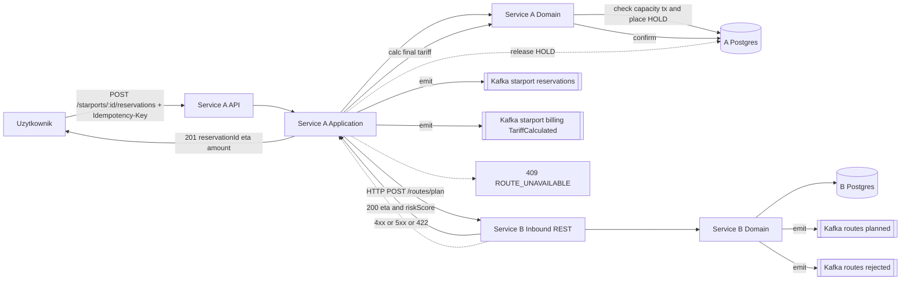
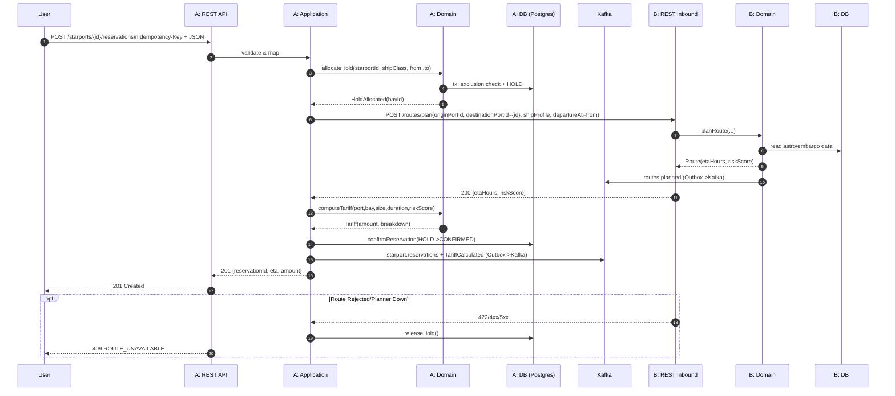
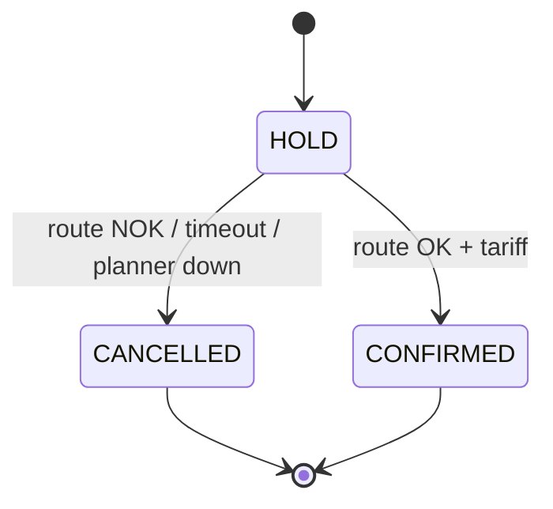

# Starport Reservation & Route Planning — Final Flow & Contracts (Confirmed)

Poniżej opis przepływu wraz z kontraktami HTTP i eventami.

---

## 🧭 End‑to‑End Flow (final)

1. **Użytkownik → A**: `POST /starports/{id}/reservations` (z `Idempotency-Key`).
2. **A (tx)**: walidacja → alokacja **HOLD** (wybór bay) → **wołanie B** (`/routes/plan`) z `originPortId` i `destinationPortId={id}`.
3. **B**: planuje trasę → zwraca `200` z `etaHours`, `riskScore` (oraz emituje `RoutePlanned`).
4. **A**: oblicza **ostateczną taryfę** (z uwzględnieniem **riskScore**) → **CONFIRM** rezerwację → emituje `StarportReservationCreated` i `TariffCalculated` → zwraca **201** do użytkownika (z `reservationId`, `eta`, `amount`).
5. **Błąd trasy** (`422` lub `4xx/5xx` z B): **A zwalnia HOLD** → zwraca **409 ROUTE_UNAVAILABLE** do użytkownika (bez kompensacji).

> *Krytyczne miejsca*: HOLD ma **TTL** (np. 2–5 min); retry do B z **exponential backoff**; wszystkie eventy przez **Outbox**.

---

## 🗺️ Flowchart (happy path + odrzucenia)



---

## 📜 Sequence Diagram (szczegółowy)



---

## 🧾 HTTP Contracts

### 1) **User → A: Create Reservation**

`POST /api/v1/starports/{starportId}/reservations`

**Headers (wymagane)**

* `Idempotency-Key: <uuid>`
* `Content-Type: application/json`
* `Accept: application/json`

**Request**

```json
{
  "shipId": "SS-Enterprise-01",
  "shipClass": "FREIGHTER_MK2",
  "startAt": "2025-10-14T14:00:00Z",
  "endAt":   "2025-10-14T18:00:00Z",
  "requestRoute": true,
  "originPortId": "SP-77-NARSHADDA"
}
```

**201 Created**

```json
{
  "reservationId": "RSV-8842",
  "starportId": "SP-02-TATOOINE-MOS",
  "dockingBayId": "b7a761c9-5093-44d9-9fd2-48d6541aaa7c",
  "startAt": "2025-10-14T14:00:00Z",
  "endAt": "2025-10-14T18:00:00Z",
  "amount": 120.50,
  "route": { "routeId": "ROUTE-9F21", "etaLY": 18.7, "riskScore": 0.4 }
}
```

**409 Conflict** (brak miejsca lub trasy)

```json
{ "error": "ROUTE_UNAVAILABLE", "message": "Cannot plan route from SP-77-NARSHADDA to SP-02-TATOOINE-MOS" }
```

**400 Bad Request** — walidacja (`from<to`, klasa statku, nagłówek idempotencji).
**503 Service Unavailable** — gdy A nie może dotrzeć do B po retry/backoff.

---

### 2) **A → B: Plan Route**

`POST http://lb://trade-route-planner/routes/plan`

**Request**

```json
{
  "originPortId": "SP-77-NARSHADDA",
  "destinationPortId": "SP-02-TATOOINE-MOS",
  "shipProfile": { "class": "FREIGHTER_MK2", "fuelRangeLY": 24.0 }
}
```

**200 OK**

```json
{
  "routeId": "ROUTE-9F21",
  "etaHours": 18.7,
  "riskScore": 0.32,
  "correlationId": "<uuid>"
}
```

**422 Unprocessable Entity**

```json
{ "error": "ROUTE_REJECTED", "reason": "INSUFFICIENT_RANGE" }
```

**4xx/5xx** — błędy domenowe lub chwilowa niedostępność (A stosuje retry/backoff z limitem).

---

## 📣 Event Contracts (Kafka + Outbox/Inbox)

### Meta (nagłówki wspólne)

* `eventType`, `schemaVersion`, `eventId` (UUID), `occurredAt` (UTC),
* `reservationId`, `correlationId`, `traceId`.
* **Message key**: `reservationId` (porządek w partycji).

### **B → routes.planned (RoutePlanned v1)**

Topic: `routes.planned`

```json
{
  "eventType": "RoutePlanned",
  "schemaVersion": "v1",
  "eventId": "9a1b...",
  "occurredAt": "2025-10-14T10:01:13.111Z",
  "reservationId": "RSV-8842",
  "routeId": "ROUTE-9F21",
  "etaHours": 18.7,
  "riskScore": 0.32,
  "originPortId": "SP-77-NARSHADDA",
  "destinationPortId": "SP-02-TATOOINE-MOS"
}
```

### **B → routes.rejected (RouteRejected v1)**

Topic: `routes.rejected`

```json
{
  "eventType": "RouteRejected",
  "schemaVersion": "v1",
  "eventId": "77de...",
  "occurredAt": "2025-10-14T10:01:13.222Z",
  "reservationId": "RSV-8842",
  "reason": "INSUFFICIENT_RANGE",
  "details": { "requiredRangeLY": 27.4, "availableRangeLY": 24.0 }
}
```

### **A → starport.reservations (StarportReservationCreated v1)**

Topic: `starport.reservations`

```json
{
  "eventType": "StarportReservationCreated",
  "schemaVersion": "v1",
  "eventId": "ac21...",
  "occurredAt": "2025-10-14T10:01:14.000Z",
  "reservationId": "RSV-8842",
  "starportId": "SP-02-TATOOINE-MOS",
  "dockingBayId": "BAY-14",
  "shipId": "SS-Enterprise-01",
  "shipClass": "FREIGHTER_MK2",
  "from": "2025-10-14T14:00:00Z",
  "to": "2025-10-14T18:00:00Z"
}
```

### **A → starport.billing (TariffCalculated v2)**

Topic: `starport.billing`

```json
{
  "eventType": "TariffCalculated",
  "schemaVersion": "v2",
  "eventId": "14f3...",
  "occurredAt": "2025-10-14T10:01:14.050Z",
  "reservationId": "RSV-8842",
  "starportId": "SP-02-TATOOINE-MOS",
  "dockingBayId": "BAY-14",
  "from": "2025-10-14T14:00:00Z",
  "to": "2025-10-14T18:00:00Z",
  "tariff": {
    "currency": "CR",
    "amount": 120.50,
    "breakdown": {
      "portBase": 80.00,
      "baySizeMultiplier": 1.25,
      "durationHours": 4.0,
      "riskScore": 0.32,
      "riskDiscountPct": 9.6
    }
  }
}
```

> **Dlaczego v2?** Przenosimy kalkulację po udanym planie trasy (potrzebny `riskScore`) i dodajemy pole `riskDiscountPct`.

---

## 💸 Formuła taryfy (konfigurowalna)

Niech:

* `base = portRate[starportId][baySize]` *(CR/h)*,
* `duration = hours(from,to)`,
* `riskDiscountPct = min(maxRiskDiscountPct, riskAlpha * riskScore * 100)` *(np. `maxRiskDiscountPct=20`, `riskAlpha=0.3` → dla `riskScore=1.0` zniżka 30%, przycięta do 20%)*.
* **Kwota**: `amount = base * duration * baySizeMultiplier * (1 - riskDiscountPct/100)`.

Parametry (`portRate`, `baySizeMultiplier`, `riskAlpha`, `maxRiskDiscountPct`) w tabelach konfiguracyjnych A.

---

## 🔐 Idempotencja i FCFS

* **Nagłówek** `Idempotency-Key` → tabela `reservation_requests` z unikalnym `(clientId, starportId, from, to, idempotencyKey)`. Duplikat zwraca ten sam wynik **201** (lub poprzedni błąd).
* **FCFS**: `SELECT ... FOR UPDATE SKIP LOCKED` na wolnych bayach + **exclusion constraint** na `tstzrange(bay_id, [from,to))` w Postgres ograniczający nakładanie się rezerwacji.
* **Optimistic locking** na `reservation.version`.

---

## 📦 Inbox/Outbox (A i B)

* **Outbox**: `event_outbox(id, aggregate_id, type, payload, headers, created_at, published_at null)` + publisher batch.
* **Inbox**: `event_inbox(event_id pk, type, processed_at, status, dedup_key)` dla idempotentnej konsumpcji.
* Wszystkie emisje (`StarportReservationCreated`, `TariffCalculated`, `RoutePlanned`, `RouteRejected`) zapisujemy **w tej samej transakcji** co zmiany domenowe.

---

## 🧱 Stany rezerwacji (A)

* `HOLD` (z `expiresAt`) → `CONFIRMED` → `REJECTED` (zwolniony slot).
* Cleanup job: wygaszanie przeterminowanych HOLD.



---

## 🧩 Architektura i komponenty

**A (Layered)**

* API: `ReservationController`
* Application: `ReservationService` (`reserveAndPlanRoute`)
* Domain: `Reservation`, `BayAllocator`, `TariffEngine`
* Infra: `ReservationRepository`, `OutboxPublisher`, `RoutePlannerClient` (HTTP), `Clock`, `ConfigRepository`

**B (Hexagonal)**

* **Port**: `PlanRouteUseCase.plan(originPortId, destinationPortId, shipProfile, departureAt)`
* **Adapters**: REST (in), Postgres (astro/embargo data), HTTP (zewnętrzne źródła), OutboxPublisher (events)

---

## 🧪 Kody błędów (A)

* `NO_CAPACITY`, `INVALID_WINDOW`, `UNSUPPORTED_SHIP_CLASS`, `ROUTE_UNAVAILABLE`, `PLANNER_UNAVAILABLE`, `IDEMPOTENCY_REQUIRED`, `IDEMPOTENCY_CONFLICT`.
