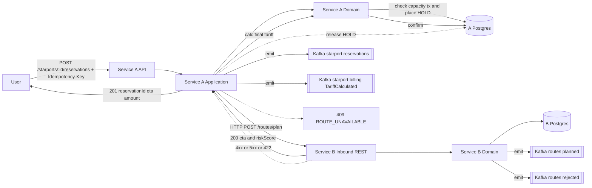
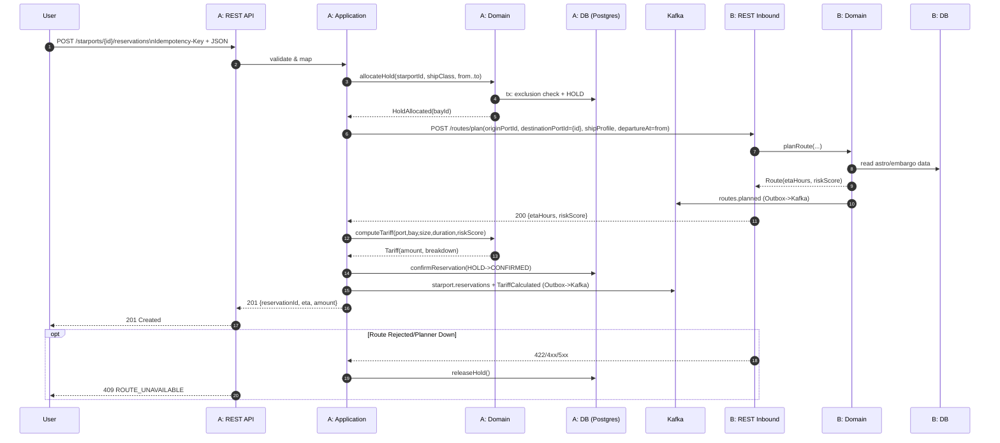
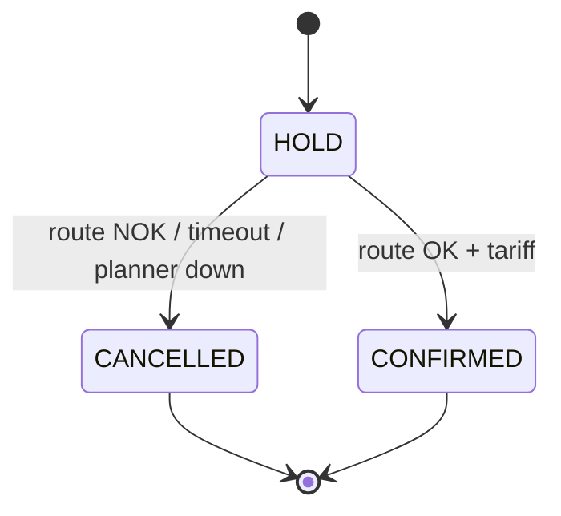

# Starport Reservation & Route Planning — Final Flow & Contracts (Confirmed)

Below is a description of the flow along with HTTP contracts and events.

---

## 🧭 End‑to‑End Flow (final)

1. **User → A**: `POST /starports/{id}/reservations` (with `Idempotency-Key`).
2. **A (tx)**: validation → **HOLD** allocation (bay selection) → **calling B** (`/routes/plan`) with `originPortId` and `destinationPortId={id}`.
3. **B**: plans route → returns `200` with `etaHours`, `riskScore` (and emits `RoutePlanned`).
4. **A**: calculates **final tariff** (taking **riskScore** into account) → **CONFIRM** reservation → emits `StarportReservationCreated` and `TariffCalculated` → returns **201** to user (with `reservationId`, `eta`, `amount`).
5. **Route error** (`422` or `4xx/5xx` from B): **A releases HOLD** → returns **409 ROUTE_UNAVAILABLE** to user (no compensation).

> *Critical points*: HOLD has a **TTL** (e.g. 2–5 min); retry to B with **exponential backoff**; all events via **Outbox**.

---

## 🗺️ Flowchart (happy path + rejections)


```mermaid
flowchart LR
    U[User] -->|POST /starports/:id/reservations + Idempotency-Key| A_API[Service A API]
    A_API --> A_APP[Service A Application]
    A_APP --> A_DOM[Service A Domain]
    A_DOM -->|check capacity tx and place HOLD| A_DB[(A Postgres)]
    A_APP -->|HTTP POST /routes/plan| B_API[Service B Inbound REST]
    B_API --> B_CORE[Service B Domain]
    B_CORE --> B_DB[(B Postgres)]
    B_CORE -->|emit| B_EVT_OK[[Kafka routes planned]]
    B_CORE -->|emit| B_EVT_NOK[[Kafka routes rejected]]
    B_API -->|200 eta and riskScore| A_APP
    A_APP -->|calc final tariff| A_DOM
    A_DOM -->|confirm| A_DB
    A_APP -->|emit| A_EVT1[[Kafka starport reservations]]
    A_APP -->|emit| A_EVT2[[Kafka starport billing TariffCalculated]]
    A_APP -->|201 reservationId eta amount| U

    %% Error branch
    B_API -. "4xx or 5xx or 422" .-> A_APP
    A_APP -. "release HOLD" .-> A_DB
    A_APP -.-> U_ERR[409 ROUTE_UNAVAILABLE]
```

---

## 📜 Sequence Diagram (detailed)


```mermaid
sequenceDiagram
    autonumber
    participant U as User
    participant A_API as A: REST API
    participant A_APP as A: Application
    participant A_DOM as A: Domain
    participant A_DB as A: DB (Postgres)
    participant K as Kafka
    participant B_API as B: REST Inbound
    participant B_CORE as B: Domain
    participant B_DB as B: DB

    U->>A_API: POST /starports/{id}/reservations\nIdempotency-Key + JSON
    A_API->>A_APP: validate & map
    A_APP->>A_DOM: allocateHold(starportId, shipClass, from..to)
    A_DOM->>A_DB: tx: exclusion check + HOLD
    A_DOM-->>A_APP: HoldAllocated(bayId)
    A_APP->>B_API: POST /routes/plan(originPortId, destinationPortId={id}, shipProfile, departureAt=from)
    B_API->>B_CORE: planRoute(...)
    B_CORE->>B_DB: read astro/embargo data
    B_CORE-->>B_API: Route(etaHours, riskScore)
    B_CORE->>K: routes.planned (Outbox->Kafka)
    B_API-->>A_APP: 200 {etaHours, riskScore}
    A_APP->>A_DOM: computeTariff(port,bay,size,duration,riskScore)
    A_DOM-->>A_APP: Tariff(amount, breakdown)
    A_APP->>A_DB: confirmReservation(HOLD->CONFIRMED)
    A_APP->>K: starport.reservations + TariffCalculated (Outbox->Kafka)
    A_APP-->>A_API: 201 {reservationId, eta, amount}
    A_API-->>U: 201 Created

    opt Route Rejected/Planner Down
      B_API-->>A_APP: 422/4xx/5xx
      A_APP->>A_DB: releaseHold()
      A_API-->>U: 409 ROUTE_UNAVAILABLE
    end
```

---

## 🧾 HTTP Contracts

### 1) **User → A: Create Reservation**

`POST /api/v1/starports/{starportId}/reservations`

**Headers (required)**

* `Idempotency-Key: <uuid>`
* `Content-Type: application/json`
* `Accept: application/json`

**Request**

```json
{
  "shipId": "SS-Enterprise-01",
  "shipClass": "FREIGHTER_MK2",
  "startAt": "2025-10-14T14:00:00Z",
  "endAt":   "2025-10-14T18:00:00Z",
  "requestRoute": true,
  "originPortId": "SP-77-NARSHADDA"
}
```

**201 Created**

```json
{
  "reservationId": "RSV-8842",
  "starportId": "SP-02-TATOOINE-MOS",
  "dockingBayId": "b7a761c9-5093-44d9-9fd2-48d6541aaa7c",
  "startAt": "2025-10-14T14:00:00Z",
  "endAt": "2025-10-14T18:00:00Z",
  "amount": 120.50,
  "route": { "routeId": "ROUTE-9F21", "etaLY": 18.7, "riskScore": 0.4 }
}
```

**409 Conflict** (no available slot or route)

```json
{ "error": "ROUTE_UNAVAILABLE", "message": "Cannot plan route from SP-77-NARSHADDA to SP-02-TATOOINE-MOS" }
```

**400 Bad Request** — validation (`from<to`, ship class, idempotency header).
**503 Service Unavailable** — when A cannot reach B after retry/backoff.

---

### 2) **A → B: Plan Route**

`POST http://lb://trade-route-planner/routes/plan`

**Request**

```json
{
  "originPortId": "SP-77-NARSHADDA",
  "destinationPortId": "SP-02-TATOOINE-MOS",
  "shipProfile": { "class": "FREIGHTER_MK2", "fuelRangeLY": 24.0 }
}
```

**200 OK**

```json
{
  "routeId": "ROUTE-9F21",
  "etaHours": 18.7,
  "riskScore": 0.32,
  "correlationId": "<uuid>"
}
```

**422 Unprocessable Entity**

```json
{ "error": "ROUTE_REJECTED", "reason": "INSUFFICIENT_RANGE" }
```

**4xx/5xx** — domain errors or temporary unavailability (A applies retry/backoff with a limit).

---

## 📣 Event Contracts (Kafka + Outbox/Inbox)

### Meta (common headers)

* `eventType`, `schemaVersion`, `eventId` (UUID), `occurredAt` (UTC),
* `reservationId`, `correlationId`, `traceId`.
* **Message key**: `reservationId` (partition ordering).

### **B → routes.planned (RoutePlanned v1)**

Topic: `routes.planned`

```json
{
  "eventType": "RoutePlanned",
  "schemaVersion": "v1",
  "eventId": "9a1b...",
  "occurredAt": "2025-10-14T10:01:13.111Z",
  "reservationId": "RSV-8842",
  "routeId": "ROUTE-9F21",
  "etaHours": 18.7,
  "riskScore": 0.32,
  "originPortId": "SP-77-NARSHADDA",
  "destinationPortId": "SP-02-TATOOINE-MOS"
}
```

### **B → routes.rejected (RouteRejected v1)**

Topic: `routes.rejected`

```json
{
  "eventType": "RouteRejected",
  "schemaVersion": "v1",
  "eventId": "77de...",
  "occurredAt": "2025-10-14T10:01:13.222Z",
  "reservationId": "RSV-8842",
  "reason": "INSUFFICIENT_RANGE",
  "details": { "requiredRangeLY": 27.4, "availableRangeLY": 24.0 }
}
```

### **A → starport.reservations (StarportReservationCreated v1)**

Topic: `starport.reservations`

```json
{
  "eventType": "StarportReservationCreated",
  "schemaVersion": "v1",
  "eventId": "ac21...",
  "occurredAt": "2025-10-14T10:01:14.000Z",
  "reservationId": "RSV-8842",
  "starportId": "SP-02-TATOOINE-MOS",
  "dockingBayId": "BAY-14",
  "shipId": "SS-Enterprise-01",
  "shipClass": "FREIGHTER_MK2",
  "from": "2025-10-14T14:00:00Z",
  "to": "2025-10-14T18:00:00Z"
}
```

### **A → starport.billing (TariffCalculated v2)**

Topic: `starport.billing`

```json
{
  "eventType": "TariffCalculated",
  "schemaVersion": "v2",
  "eventId": "14f3...",
  "occurredAt": "2025-10-14T10:01:14.050Z",
  "reservationId": "RSV-8842",
  "starportId": "SP-02-TATOOINE-MOS",
  "dockingBayId": "BAY-14",
  "from": "2025-10-14T14:00:00Z",
  "to": "2025-10-14T18:00:00Z",
  "tariff": {
    "currency": "CR",
    "amount": 120.50,
    "breakdown": {
      "portBase": 80.00,
      "baySizeMultiplier": 1.25,
      "durationHours": 4.0,
      "riskScore": 0.32,
      "riskDiscountPct": 9.6
    }
  }
}
```

> **Why v2?** We move the calculation after a successful route plan (requires `riskScore`) and add the `riskDiscountPct` field.

---

## 💸 Tariff Formula (configurable)

Let:

* `base = portRate[starportId][baySize]` *(CR/h)*,
* `duration = hours(from,to)`,
* `riskDiscountPct = min(maxRiskDiscountPct, riskAlpha * riskScore * 100)` *(e.g. `maxRiskDiscountPct=20`, `riskAlpha=0.3` → for `riskScore=1.0` discount is 30%, capped at 20%)*.
* **Amount**: `amount = base * duration * baySizeMultiplier * (1 - riskDiscountPct/100)`.

Parameters (`portRate`, `baySizeMultiplier`, `riskAlpha`, `maxRiskDiscountPct`) are stored in configuration tables of A.

---

## 🔐 Idempotency and FCFS

* **Header** `Idempotency-Key` → table `reservation_requests` with unique `(clientId, starportId, from, to, idempotencyKey)`. A duplicate returns the same **201** result (or the previous error).
* **FCFS**: `SELECT ... FOR UPDATE SKIP LOCKED` on available bays + **exclusion constraint** on `tstzrange(bay_id, [from,to))` in Postgres preventing overlapping reservations.
* **Optimistic locking** on `reservation.version`.

---

## 📦 Inbox/Outbox (A and B)

* **Outbox**: `event_outbox(id, aggregate_id, type, payload, headers, created_at, published_at null)` + publisher batch.
* **Inbox**: `event_inbox(event_id pk, type, processed_at, status, dedup_key)` for idempotent consumption.
* All emissions (`StarportReservationCreated`, `TariffCalculated`, `RoutePlanned`, `RouteRejected`) are saved **in the same transaction** as domain changes.

---

## 🧱 Reservation States (A)

* `HOLD` (with `expiresAt`) → `CONFIRMED` → `REJECTED` (released slot).
* Cleanup job: expiring timed-out HOLDs.


```mermaid
stateDiagram-v2
    [*] --> HOLD
    HOLD --> CONFIRMED: route OK + tariff
    HOLD --> CANCELLED: route NOK / timeout / planner down
    CANCELLED --> [*]
    CONFIRMED --> [*]
```

---

## 🧩 Architecture and Components

**A (Layered)**

* API: `ReservationController`
* Application: `ReservationService` (`reserveAndPlanRoute`)
* Domain: `Reservation`, `BayAllocator`, `TariffEngine`
* Infra: `ReservationRepository`, `OutboxPublisher`, `RoutePlannerClient` (HTTP), `Clock`, `ConfigRepository`

**B (Hexagonal)**

* **Port**: `PlanRouteUseCase.plan(originPortId, destinationPortId, shipProfile, departureAt)`
* **Adapters**: REST (in), Postgres (astro/embargo data), HTTP (external sources), OutboxPublisher (events)

---

## 🧪 Error Codes (A)

* `NO_CAPACITY`, `INVALID_WINDOW`, `UNSUPPORTED_SHIP_CLASS`, `ROUTE_UNAVAILABLE`, `PLANNER_UNAVAILABLE`, `IDEMPOTENCY_REQUIRED`, `IDEMPOTENCY_CONFLICT`.
